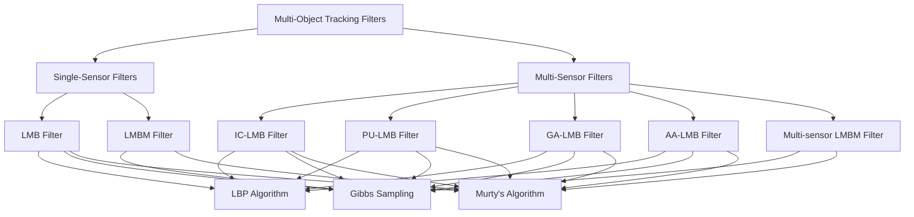
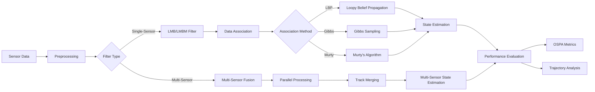
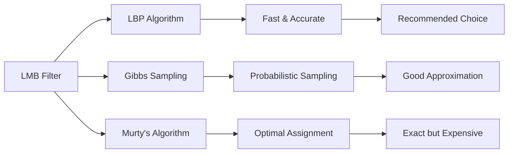

# Multi-sensor Labelled Multi-Bernoulli Filters 🎯

[](https://www.mathworks.com/products/matlab.html)
[](LICENSE)
[](docs/)

**Advanced implementations of multi-sensor labelled multi-Bernoulli (LMB) and LMB mixture (LMBM) filters for multi-object tracking in complex environments.**

This repository provides state-of-the-art MATLAB implementations of various LMB and LMBM filters, featuring both single-sensor and multi-sensor configurations. The filters support multiple data association algorithms and are optimized for linear-Gaussian dynamics with comprehensive performance evaluation tools.

## 🌟 Key Features

- **Multiple Filter Types**: LMB, LMBM, IC-LMB, PU-LMB, GA-LMB, AA-LMB
- **Advanced Data Association**: Loopy Belief Propagation, Gibbs Sampling, Murty's Algorithm
- **Multi-sensor Fusion**: Parallel and sequential processing capabilities
- **Performance Analysis**: OSPA metrics, runtime benchmarks, accuracy trials
- **Flexible Architecture**: Modular design for easy extension and customization

## 📋 Requirements

- **MATLAB R2022a+**
- **Statistics and Machine Learning Toolbox** (for Poisson random variable simulation)
- **Optimization Toolbox** (recommended for enhanced performance)

## 🏗️ System Architecture

### Filter Hierarchy



### Data Flow Architecture



## 🚀 Quick Start

### Basic Single-Sensor Example

```matlab
% Set up the environment
setPath;

% Configure single-sensor LMB filter
useLmbFilter = true;
model = generateModel(10, 0.95, 'LBP', 'Fixed');

% Generate synthetic data
[groundTruth, measurements, groundTruthRfs] = generateGroundTruth(model);

% Run the filter
if useLmbFilter
    stateEstimates = runLmbFilter(model, measurements);
else
    stateEstimates = runLmbmFilter(model, measurements);
end

% Visualize results
plotResults(model, measurements, groundTruth, stateEstimates, groundTruthRfs);
```

### Multi-Sensor Configuration

```matlab
% Configure multi-sensor environment
numberOfSensors = 3;
clutterRates = [5 5 5];
detectionProbabilities = [0.67 0.70 0.73];
q = [4 3 2];

model = generateMultisensorModel(numberOfSensors, clutterRates, ...
    detectionProbabilities, q, 'PU', 'LBP', 'Fixed');

% Generate multi-sensor observations
[groundTruth, measurements, groundTruthRfs] = generateMultisensorGroundTruth(model);

% Run parallel update LMB filter
stateEstimates = runParallelUpdateLmbFilter(model, measurements);

% Analyze results
plotMultisensorResults(model, measurements, groundTruth, stateEstimates, groundTruthRfs);
```

## 📊 Filter Implementations

### Single-Sensor Filters

#### Labelled Multi-Bernoulli (LMB) Filter

The **LMB filter** provides robust multi-object tracking through three sophisticated data association algorithms:



1. **Loopy Belief Propagation (LBP)** 🌟 *Recommended*
   - Williams et al.'s efficient algorithm
   - Approximates posterior existence probabilities
   - Computationally inexpensive with high accuracy
   - Best balance of speed and performance

2. **Gibbs Sampling**
   - Stochastic sampling approach
   - Approximates marginal association probabilities
   - Relatively inexpensive computational cost
   - Good for uncertainty quantification

3. **Murty's Algorithm**
   - Vo and Vo's .mex implementation
   - Optimal assignment generation
   - Higher computational cost but exact results
   - Suitable for benchmarking

#### LMB Mixture (LMBM) Filter

The **LMBM filter** extends the LMB framework with hypothesis management:

- Supports Gibbs sampling and Murty's algorithm
- Cannot use LBP (requires data association events)
- Exact closed-form solution representation
- Higher memory requirements for complex scenarios

### Multi-Sensor Filters

#### 🔄 Parallel Update LMB (PU-LMB) Filter

```mermaid
sequenceD diagram
    participant S1 as Sensor 1
    participant S2 as Sensor 2
    participant S3 as Sensor 3
    participant F as Fusion Center
    
    S1->>F: Measurement Update 1
    S2->>F: Measurement Update 2
    S3->>F: Measurement Update 3
    F->>F: Parallel Processing
    F->>F: Track Fusion
```

- Mathematical manipulation of multi-sensor Bayes filter
- Assumes sensor independence
- Most accurate among approximate multi-sensor filters
- Parallel measurement updates for efficiency

#### 📐 Geometric Average LMB (GA-LMB) Filter

- Weighted geometric average fusion
- Excellent object localization accuracy
- Poor instantaneous cardinality estimation
- Robust covariance estimation for dependent sensors

#### ➕ Arithmetic Average LMB (AA-LMB) Filter

- Weighted arithmetic average fusion
- Superior cardinality estimation vs GA-LMB
- Does not assume sensor independence
- Propagates full Gaussian mixtures

#### 🔄 Iterated-Corrector LMB (IC-LMB) Filter

- Sequential sensor processing
- Gaussian mixture propagation
- Typical multi-sensor LMB implementation
- Higher computational cost but accurate

## 📁 Project Structure

```text
multisensor-lmb-filters/
├── 📁 common/                     # Shared utilities and algorithms
│   ├── assignmentoptimal.*        # Optimal assignment solvers (MEX files)
│   ├── computeSimulationOspa.m    # OSPA metric computation
│   ├── esf.m                      # Elementary symmetric functions
│   ├── generateGroundTruth.m      # Synthetic data generation
│   ├── generateModel.m            # Single-sensor model configuration
│   ├── generateMultisensorModel.m # Multi-sensor model setup
│   ├── Hungarian.m                # Hungarian algorithm implementation
│   ├── loopyBeliefPropagation.m   # LBP algorithm core
│   ├── munkres.m                  # Munkres assignment algorithm
│   ├── murtysAlgorithm.m          # Murty's algorithm implementation
│   ├── ospa.m                     # OSPA distance calculation
│   └── plot*.m                    # Visualization utilities
├── 📁 lmb/                        # Single-sensor LMB filter
│   ├── computePosteriorLmbSpatialDistributions.m
│   ├── generateLmbAssociationMatrices.m
│   ├── lmbGibbsSampling.m
│   ├── lmbMurtysAlgorithm.m
│   ├── lmbPredictionStep.m
│   └── runLmbFilter.m
├── 📁 lmbm/                       # LMB Mixture filter
│   ├── determinePosteriorHypothesisParameters.m
│   ├── generateLmbmAssociationMatrices.m
│   ├── lmbmGibbsSampling.m
│   └── runLmbmFilter.m
├── 📁 multisensorLmb/             # Multi-sensor LMB filters
│   ├── *LmbTrackMerging.m         # Track fusion algorithms
│   ├── runIcLmbFilter.m           # IC-LMB implementation
│   └── runParallelUpdateLmbFilter.m # PU/GA/AA-LMB filters
├── 📁 multisensorLmbm/            # Multi-sensor LMBM filter
├── 📁 marginalEvaluations/        # Algorithm comparison tools
├── 📁 trials/                     # Performance evaluation scripts
├── 📜 runFilters.m                # Single-sensor demo script
├── 📜 runMultisensorFilters.m     # Multi-sensor demo script
└── 📜 setPath.m                   # Environment setup
```

## 🔬 Performance Analysis Tools

### Marginal Distribution Evaluations

The `marginalEvaluations/` directory contains tools for comparing data association algorithms:

1. **evaluateMarginalDistributions.m** - Compare LBP vs Murty's vs Gibbs sampling
2. **evaluateSmallExamples.m** - Small-scale validation studies
3. **generateAssociationMatrices.m** - Test data generation

### Benchmark Trials

The `trials/` directory provides comprehensive performance analysis:

1. **Single-Sensor Trials**
   - `singleSensorAccuracyTrial.m` - Accuracy vs scenario complexity
   - `singleSensorClutterTrial.m` - Performance vs clutter density
   - `singleSensorDetectionProbabilityTrial.m` - Sensitivity analysis

2. **Multi-Sensor Trials**
   - `multiSensorAccuracyTrial.m` - Multi-sensor accuracy evaluation
   - `multiSensorClutterTrial.m` - Clutter robustness testing
   - `multiSensorDetectionProbabilityTrial.m` - Detection probability analysis

3. **Runtime Analysis**
   - `lmbFilterTimeTrials.m` - Computational complexity evaluation

## ⚙️ Configuration Guide

### Model Parameters

```matlab
% Basic model configuration
clutterRate = 10;              % Expected clutter returns per scan
detectionProbability = 0.95;   % Target detection probability
dataAssociationMethod = 'LBP'; % 'LBP', 'Gibbs', 'Murty', 'LBPFixed'
scenarioType = 'Fixed';        % 'Fixed' or 'Random' birth locations

model = generateModel(clutterRate, detectionProbability, ...
                     dataAssociationMethod, scenarioType);
```

### Multi-Sensor Configuration

```matlab
% Multi-sensor setup
numberOfSensors = 3;
clutterRates = [5, 8, 10];                    % Per-sensor clutter
detectionProbabilities = [0.9, 0.85, 0.95];  % Per-sensor detection
sensorPrecision = [4, 3, 2];                 % Measurement precision

model = generateMultisensorModel(numberOfSensors, clutterRates, ...
    detectionProbabilities, sensorPrecision, 'PU', 'LBP', 'Fixed');
```

## 📈 Usage Examples

### Advanced Single-Sensor Configuration

```matlab
% Custom scenario with random birth locations
numberOfTargets = 15;
model = generateModel(clutterRate, detectionProbability, ...
                     'LBP', 'Random', numberOfTargets);

% Generate longer simulation
[groundTruth, measurements] = generateGroundTruth(model, numberOfTargets);

% Run with different algorithms
algorithms = {'LBP', 'Gibbs', 'Murty'};
results = cell(1, length(algorithms));

for i = 1:length(algorithms)
    model.dataAssociationMethod = algorithms{i};
    results{i} = runLmbFilter(model, measurements);
end
```

### Performance Comparison

```matlab
% Compare filter performance
filterTypes = {'IC', 'PU', 'LMBM'};
ospaScores = zeros(length(filterTypes), simulationLength);

for i = 1:length(filterTypes)
    stateEstimates = runMultisensorFilter(model, measurements, filterTypes{i});
    ospaScores(i, :) = computeSimulationOspa(groundTruth, stateEstimates, model);
end

% Visualize performance
figure; plot(ospaScores');
legend(filterTypes);
xlabel('Time Step'); ylabel('OSPA Distance');
```

## 🧪 Additional Analysis Tools

We provide comprehensive analysis capabilities through specialized modules:

1. **marginalEvaluations/**: Compare LBP data association's approximate marginal distributions with those from Murty's algorithm and Gibbs sampling. The Gibbs sampler uses the same underlying model as the LBP algorithm.

2. **trials/**: Compare various single- and multi-sensor filters' OSPA metrics and runtimes across different scenarios including varying clutter rates, detection probabilities, and target densities.

## 🔧 Installation & Setup

1. **Clone the repository**:
   ```bash
   git clone https://github.com/sachin-deshik-10/MULTISENSOR-LMB-FILTERS.git
   cd MULTISENSOR-LMB-FILTERS
   ```

2. **Setup MATLAB environment**:
   ```matlab
   % Add project to MATLAB path
   setPath;
   
   % Verify installation
   help generateModel
   ```

3. **Run example simulations**:
   ```matlab
   % Single-sensor demo
   runFilters;
   
   % Multi-sensor demo  
   runMultisensorFilters;
   ```

## 📚 API Reference

### Core Functions

| Function | Description | Usage |
|----------|-------------|-------|
| `generateModel()` | Create single-sensor model | `model = generateModel(10, 0.95, 'LBP')` |
| `generateMultisensorModel()` | Multi-sensor configuration | `model = generateMultisensorModel(3, [5,5,5], [0.9,0.9,0.9], [4,3,2])` |
| `runLmbFilter()` | Execute LMB filter | `estimates = runLmbFilter(model, measurements)` |
| `runParallelUpdateLmbFilter()` | Run PU/GA/AA-LMB | `estimates = runParallelUpdateLmbFilter(model, measurements)` |

### Performance Metrics

| Function | Description | Output |
|----------|-------------|--------|
| `computeSimulationOspa()` | OSPA distance calculation | `ospa_scores` |
| `ospa()` | Single-step OSPA | `distance, localization, cardinality` |

## 🤝 Contributing

We welcome contributions! Please follow these guidelines:

1. **Fork the repository**
2. **Create a feature branch**: `git checkout -b feature/amazing-enhancement`
3. **Follow MATLAB coding standards**
4. **Add comprehensive documentation**
5. **Include test cases**
6. **Submit a pull request**

### Development Guidelines

- Use meaningful variable names
- Include function headers with proper documentation
- Test with multiple scenarios
- Optimize for performance where possible
- Maintain backward compatibility

## 📖 References

1. Williams, J. L. (2015). "Marginal multi-Bernoulli filters: RFS derivation of MHT, JIPDA, and association-based member"
2. Vo, B.-N., & Vo, B.-T. (2013). "Labeled random finite sets and multi-object conjugate priors"
3. Reuter, S., Vo, B.-T., Vo, B.-N., & Dietmayer, K. (2014). "The labeled multi-Bernoulli filter"

## 📄 License

This project is licensed under the MIT License - see the [LICENSE](LICENSE) file for details.

## ✨ Acknowledgments

- Research community for advancing multi-object tracking theory
- MATLAB community for computational tools and optimization
- Contributors and users for feedback and improvements

---

**🚀 Ready to track multiple objects with state-of-the-art precision? Start with our Quick Start guide above!**
