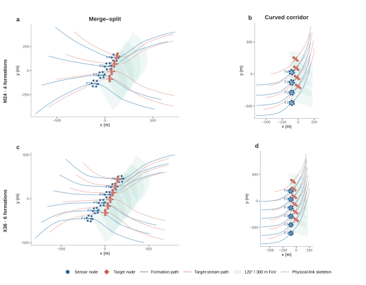

# Formation-FoV extended scenes v1

## Purpose

The original center-surround scene does not expose enough variation in how formations move, connect, and exchange information. The two development scenes below keep the sensor hardware fixed while isolating two complementary difficulties:

- **Merge-split:** separated formations enter a dense shared corridor and then branch apart. This changes the physical communication graph and tests whether a routing policy adapts without unstable switching.
- **Curved corridor:** co-oriented formations follow the same sustained turn while target streams drift smoothly across lanes. The physical formation layout remains stable, but each target stream changes its most informative formation once.

Both scenes use the same six-sensor formation, 120-degree total FoV, 300 m hard sensing range, detection model, noise model, and clutter model as the existing formation-FoV experiments. They are development scenes: geometry metrics establish plausibility and difficulty, not tracking improvement.

## One-click presets

| Scale | Merge-split | Curved corridor |
|:--|:--|:--|
| M24 | `m24-formation-fov-merge-split` | `m24-formation-fov-curved-corridor` |
| X36 | `x36-formation-fov-merge-split` | `x36-formation-fov-curved-corridor` |

The paired V46/V49 tracking runner accepts all four presets through `runFormationB4V49PairedTrackingExperiment`.

## Geometry at seed 41

| Preset | Valid | Blackout | Focus blackout | Single-formation visibility | Multi-formation visibility | Ownership handovers | Physical-edge churn | Mean visible formations | Focus load per sensor | Max target speed | Max target acceleration | Min target separation |
|:--|:--:|--:|--:|--:|--:|--:|--:|--:|--:|--:|--:|--:|
| M24 merge-split | yes | 5.3% | 2.7% | 22.5% | 72.2% | 20 | 0.00065 | 1.89 | 6.41 | 10.75 m/s | 0.82 m/s² | 18 m |
| X36 merge-split | yes | 3.4% | 1.6% | 13.7% | 82.9% | 23 | 0.00141 | 2.37 | 7.56 | 11.04 m/s | 1.07 m/s² | 18 m |
| M24 curved corridor | yes | 0.7% | 0.0% | 19.0% | 80.3% | 4 | 0.00000 | 1.92 | 6.88 | 10.24 m/s | 0.72 m/s² | 26 m |
| X36 curved corridor | yes | 0.8% | 0.0% | 11.5% | 87.6% | 4 | 0.00000 | 2.00 | 7.15 | 10.26 m/s | 0.70 m/s² | 26 m |

## Design interpretation

The merge-split scene is the stronger topology-transition test. It has nonzero physical-edge churn, frequent ownership handovers, nontrivial blackout, and substantial periods in which only one formation can observe a target. A useful dynamic-routing method should improve tracking or cross-formation consistency here without paying for excessive route churn.

The curved-corridor scene is deliberately smoother. A repeated weaving trajectory can raise the handover count, but the tested variants required 15–17 m/s target speeds and 3–4 m/s² acceleration. The retained design instead produces one clean ownership handover per target stream while preserving realistic motion and approximately two visible formations per target. It therefore isolates sensing-direction change rather than combining it with abrupt target manoeuvres.

## Scenario figure

The figure shows exact generated geometry at time step 80. Sensor and target paths cover the full episode; each translucent sector is one representative sensor's exact 120-degree, 300 m FoV for its formation. Dashed links show a readable spanning skeleton of the physical inter-formation connectivity available at that instant, not the routing policy selected by V46 or V49.

## Next experimental decision

Run the paired tracker in this order:

1. X36 merge-split, because it directly exercises the topology-transition mechanism and offers the strongest chance of separating V49 from V46.
2. X36 curved corridor, only if the convoy or merge-split result suggests that V49 benefits from changes in information ownership even when the physical graph is stable.
3. M24 versions as scale controls after an X36 method decision, rather than as the primary optimization target.

If V49 fails on X36 merge-split, the next action should be to inspect the mismatch between its route-selection proxy and actual position/cardinality error. Expanding seeds before that method decision would only increase confidence in an unchanged design.
