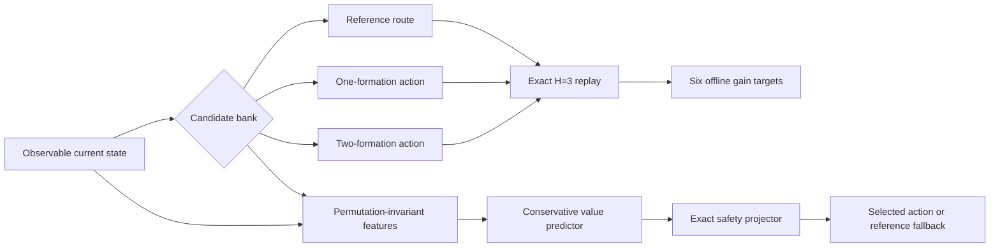

# Formation H=3 multi-scale teacher sentinel v13

## Decision after the opened M24 audit

The augmented singleton-plus-pair bank has deployment-constrained oracle
headroom on four of five opened M24 states, including two strong states.  The
five-state LOSO ridge audit nevertheless fails: the selected model falls back
to the reference everywhere, with negative mean-gain correlation and only
20% top-3 oracle capture.  More model capacity is not authorized from five
states.  The next falsifier is state and scale coverage.

## Frozen sentinel split

The sentinel uses three formation-FoV scales:

| Preset | Sensors | Formations | Local bank | Pair bank | Augmented actions |
|:--|--:|--:|--:|--:|--:|
| `d12-formation-fov` | 12 | 2 | 7 | 2 | 8 |
| `m24-formation-fov` | 24 | 4 | 13 | 7 | 19 |
| `x36-formation-fov` | 36 | 6 | 19 | 16 | 34 |

D12 is a same-hardware transfer regularizer, not a geometry-matched tracking
claim: it keeps the registered 120-degree, 300 m sensor and clutter contract,
but its two-formation scene necessarily has a different visibility geometry.
Its three sentinel seeds pass the pre-registered blackout, handover, overlap,
and sensor-load gates.  M24 and X36 remain the scales that must establish
practical headroom.

- sentinel-training seeds: 211 and 223;
- sentinel-development seed: 227;
- state times: 60 and 72;
- final validation seeds reserved and unopened: 251, 257, 263, 269, 271.

Each preset-seed trajectory runs the registered fixed CCW reference once and
captures both predecision states.  Every action then changes the first step
only and returns to the same fixed reference for the next two steps.  The
teacher stores six separate gains: network mean tracking, minimum formation,
worst sensor, consensus, attempted bytes, and delivered bytes.

### Terms used below

- **Reference route:** the fixed counter-clockwise gateway cycle used as the
  conservative default. It is a deployable baseline, not a truth oracle.
- **H=3 return:** evaluate three consecutive fusion steps. The candidate is
  executed only at the first step; steps two and three use the reference route,
  so the score measures the short downstream effect of one routing decision.
- **Local action:** change the trust mode of exactly one formation.
- **Pair action:** change two formations together at the registered conservative
  trust weight. This captures interactions that cannot be inferred by adding
  two isolated local effects.

## Information and safety boundary

Deployable features may use only the current local LMB posteriors, the current
link-probability page, current sensor positions, candidate graph/weights, and
two past selected topology pages.  Explicit target trajectories, future link
uniforms, future probability pages, seed identifiers, sensor identifiers, and
formation identifiers are excluded.  Truth and future measurements score the
offline H=3 targets only.

Every return arm must pass exact first-action replay, no policy truth use, no
repair, no payload emergency, no infeasibility, and selected rolling-B3 at
sensor and formation levels.  Reference fallback is always present.

## Sentinel gates

Before model fitting, each scale must have at least two of six states with a
positive deployment-feasible action.  M24 and X36 must each have at least one
state with gain of at least 3% and mean deployment-oracle gain of at least 2%.
D12 is a transfer/regularization scale and is reported without a strong-gain
requirement.

The ridge baseline is trained on seeds 211 and 223 and evaluated only on seed
227.  The development signal target is mean-gain Pearson at least 0.20,
deployment oracle top-3 capture at least 50%, and conservative selection safety
at least 80%.  A failure with adequate oracle headroom triggers feature or
model redesign; a failure of X36 oracle headroom triggers candidate-bank
redesign.  A message-passing model is considered only after the shared ridge
baseline is measured on this larger, disjoint sentinel.

Passing the sentinel does not authorize a final claim.  The feature contract,
training split, confidence calibration, model parameters, and exact projector
must be frozen before any reserved validation seed is opened.
