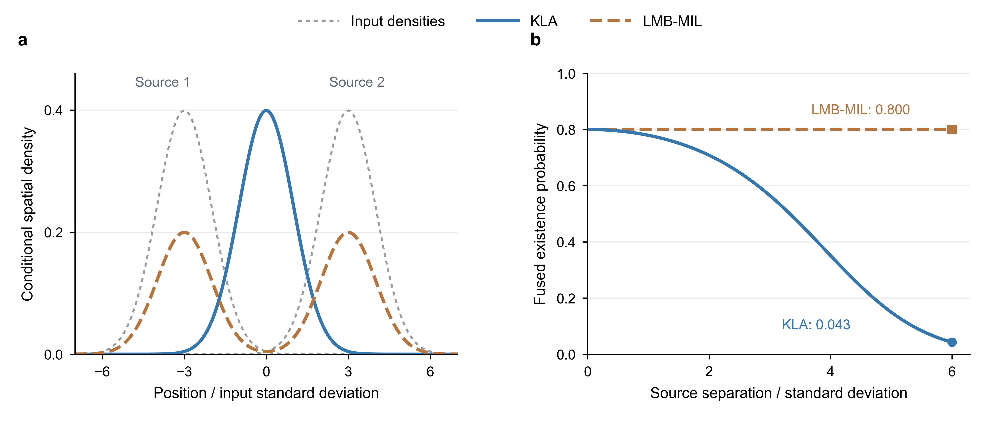

# 标签匹配融合：基线选择与下一组实验

2026-09-06。设计笔记；尚未实现新匹配算法。V288 已完成共享标签下的
MIL 融合对照：集合误差略降，但条件 RMSE 与实际字节代价明显上升，
未通过联合筛选，停止该版本扩展。完整数字见 `V288_RUN_STATUS.md`。

当前研究主线仍是有限通信下的目标存在与位置恢复。V287 提醒我们：在
判断“什么来源值得传”之前，要保证比较与融合的是可对应的目标信息。
不能把标签匹配本身当成新的路由或估计理论贡献。

本场景的共同出生标签在生成模型中已有一致语义。轮末点估计的几何对应
分歧也可能是估计误差或关联不确定性，并不自动证明标签空间不一致。
因此这是一项要验证的替代融合基线，而不是已经确诊的代码修复；强行
重命名也可能破坏原本正确的标签假设。

## 原始文献与可用程度

| 工作 | 核对内容 | 当前可用程度与限制 |
| --- | --- | --- |
| [Li 等，TSP 67(1):260--275，2019](https://doi.org/10.1109/TSP.2018.2880704) | 先最小化标签不一致指标得到匹配，再逐标签 GCI；LMB 情形可转为线性指派。 | Crossref 元数据、作者机构库摘要；正式全文未取得，不声称已复现 LM-GCI。机构库的卷号 61 与 Crossref 的 67 冲突，采用 Crossref 的 67。 |
| [Wang 等，GCI-LSM，2016 作者预印本](https://arxiv.org/html/1603.08336v1) | 式 (23) 的 Bernoulli Rényi 代价、式 (30)--(33) 的 GM 近似、算法 1 的顺序融合。 | 已读相关原文。其共同观测区域假设、未匹配轨迹舍弃与当前有限视域保留目标的要求不同，不能不加说明套用。 |
| [Gao 等，TAES 58(6):5908--5924，2022](https://doi.org/10.1109/TAES.2022.3182642) | 划分共同/独有视域子空间，以约束最小信息损失准则融合，并做标签指派。 | Crossref 元数据与出版社摘要；这是 MIL，不是把相同操作称为 KLA。需要作为完整不同视域基线另行复现。 |
| [Gao 等，TSP 68:5855--5868，2020](https://doi.org/10.1109/TSP.2020.3028496)；[2019 作者原文](https://arxiv.org/html/1911.01083v1) | Proposition 3 的 LMB-MIL；Section V-B 的空间密度匹配与未匹配代价。 | 已读相关完整公式；arXiv 明确关联此 TSP DOI，Crossref BibTeX 已获取。不能因此声称 2022 TAES 算法已复现。 |
| [LeGrand 与 Ferrari，JAIF 17(2):78--96，2022](https://keithlegrand.com/wp/wp-content/uploads/2023/05/LeGrand-2022-Split-Happens-Imprecise-and-Negative-Information-in-Gaussian-Mixture-Random-Finite-Set-Filtering.pdf) | 有限视域边界处的高斯分量拆分与负信息更新。 | 已读 Section IV 中均值近似与分量拆分的原文；它改进局部密度更新，不是标签匹配或动态路由新方法。 |

进一步读完 2019 原文的 Proposition 4 与 Remark 6 后，需要排除一个
无效变体：LMB 已经按标签分解，在来源权重和输入密度不变时，再做一次
逐标签分区并不会改变 V288 的算术融合公式。不能把这样的重新包装当成
“完整不同视域基线”。2022 论文的作者机构库仍将全文标为关闭，不能仅凭
摘要补齐其细节。当前先用 V289 检查另一条有明确原文依据的近似：局部
更新在分量均值上判断可见性，是否遗漏了跨越视域边界的概率质量。

2016 文本中的对称 Bernoulli 匹配代价（取 α=1/2）可写为

\[
c_{ab}=-2\log\left[\sqrt{(1-r_a)(1-r_b)}+
\sqrt{r_ar_b}\int\sqrt{p_a(x)p_b(x)}\,dx\right].
\]

这解释为什么只比较均值或协方差不等于比较整个 Bernoulli 判断。公式是
已有知识，不是新定理。GM 的平方根积分一般没有闭式 GM 表达；原文使用
幂混合近似，不能把所得匹配代价称为精确。该代价也没有单独解决未匹配
轨迹的代价、不同视域或跨时间重命名。只用原代价加一个普通矩形指派，
不足以宣称完整 LM-GCI 复现。

## 实验设计

V288 已将第一步单独检验：固定共享出生标签和稀疏骨干，保持相同的
尝试/送达路由掩码，运行 LMB-MIL 算术融合对照。消息内容和字节数会随
后验递推改变，并非固定。缺失标签以零存在概率补到
共同标签空间，不能沿用 KLA 的缺失来源排除。GM 拼接后合并完全相同
分量，再按原 8 分量上限截断并记录损失。它不是完整不同视域 MIL，
也不包含重匹配。具体范围与停止条件见 `V288_COMMON_LABEL_MIL_DESIGN.md`。
其结果不支持继续这一版本，也不自动支持增加标签重匹配。下表保留为
未来基线的因果比较结构，不表示已有新匹配算法或正在运行的实验。

先明确具体采用哪一个可完整读取的方法及其未匹配规则，不拼装不明来源
的“标准实现”。把匹配放在接收侧、当前实际收到的后验之后；只用可见
后验，不用真值标签对应、未来状态或免费全网来源。标签和来源时间必须
分别维护，不能把历史继承的关联字段当作新观测。

| 对照 | 固定编队树 | 已实现稀疏骨干 | 要区分的作用 |
| --- | --- | --- | --- |
| 当前逐标签融合 | 复用相同协议已有基线；缺缓存的短前缀按需补跑 | 复用 V242 前缀 | 现有路由差异 |
| 明确文献版本的标签匹配融合 | 新运行 | 新运行 | 同路由内是融合效应；同融合下才是路由效应 |

首轮固定 X36、seed 1301、前 40 步，保留完整 160 步观测生成后截取前缀
的随机数协议、120°/300 m 感知、原链路与稀疏结构，不扫描超参数，也不
同时叠加 V284 的未更新先验排除。对照目的不是追求更低的匹配代价，而是
E-OSPA、条件 RMSE、数量误差、可计算覆盖率、逐编队尾部和一致性是否
共同改善；尝试发送字节仍包括失败包，记录额外匹配计算与任何控制字段。
前缀不使用 t=40--140 的全程焦点指标冒充同一统计量。

若匹配改善融合但静态与动态路由差异消失，应收缩路由贡献，而不是换
基线制造优势。若匹配只降低距离代价、却伤害数量或定位，则停止该版本，
回到不同视域和时效问题。只有同融合规则下的路由收益成立，才进入完整
160 步与 M24 配对；之后冻结方法、使用未打开的新种子验证。

## 来源与复现记录



解析示意，不是跟踪实验：两个输入的存在概率均为 0.8、融合权重相等，
空间密度是标准差均为 1 的单高斯。左图均值相距 6 个标准差；KLA 的
条件位置密度位于两者中间，MIL 保留两个峰。右图改变输入间距：在左图
所用间距处，KLA 的空间重叠因子约为 0.0111，融合存在概率降至 0.0425；
MIL 保持 0.8。图中没有目标真值，因而不能据此说任一位置更准确。MIL
保留候选不等于正确恢复目标，这正是配对实验需要同时检查数量和位置的原因。
该图由 Python 从明确公式生成，不涉及原画板替换，也不加入论文主结果图。

文献专用 MCP 接口未挂载，使用出版社、作者机构库、arXiv 和 Crossref。
两篇期刊 BibTeX 通过以下 API 获取，均返回成功；只规范标题中的 HTML
排版标记和 BibTeX 连字符，不凭记忆补作者。

```sh
curl --fail --location 'https://api.crossref.org/works/10.1109%2FTSP.2018.2880704/transform/application/x-bibtex'
curl --fail --location 'https://api.crossref.org/works/10.1109%2FTAES.2022.3182642/transform/application/x-bibtex'
```

2019 作者机构库：[FLORE](https://flore.unifi.it/handle/2158/1140832)。该页
标注全文关闭，OpenAlex 也未列出开放版本。因此目前只在论文中引用其
已核对的高层方法，不把尚未读取的算法细节写成已实现基线。实现前仍需
取得正式全文，或明确选择另一篇可读取且适配有限视域的方法。
