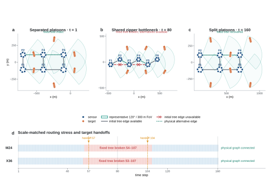

# V276 zipper-merge scene

## Purpose

The existing scene suite separates visual variety from routing stress.  The
parallel-convoy and linear-relay scenes are useful stable controls, but their
initial routes stay physically available throughout M24 and X36.  The
formation-braid scene does require dynamic tree repair, yet one scene family
cannot establish that the mechanism transfers to a different motion pattern.

V276 adds a non-radial road-network case.  Two parallel formation platoons
enter a shared bottleneck in zipper order, travel through it, and split back
into two lanes.  The maneuver changes which formations are physical
neighbours without ever disconnecting the complete formation graph.

**Figure. V276 scale-matched zipper-merge scene.** Panels a--c show exact X36
geometry at the separated, shared-bottleneck and split phases. Each formation
contains six sensor nodes; one 120-degree, 300 m sector represents the shared
FoV heading within that formation. Orange diamonds are targets. Grey edges
belong to the initial formation tree, red crossed edges are tree links that
are no longer physically reachable, and teal dotted edges are currently
reachable alternatives. Panel d shows that the initial tree fails over one
sustained interval at both scales while the full physical formation graph
remains connected. The registered target handoffs at steps 57 and 104 lie
inside that interval. The figure uses generated geometry and physical
reachability only; it contains no filtering or tracking outcome.

## Scale-normalized construction

Every formation contains six sensors with the frozen 120-degree total FoV and
300 m range.  M24 uses two longitudinal stations in each lane; X36 uses three.
Adding scale appends another identical road module rather than compressing the
same area or changing the communication radius.

At the separated endpoints, same-lane stations are 300 m apart and paired
upper/lower formations are 220 m apart.  At the bottleneck, all formations
form a zipper chain with 180 m longitudinal pitch and 100 m upper/lower
separation.  With the common 270 m communication radius, initial same-lane
tree edges disappear while new adjacent zipper edges keep the physical graph
connected.

Target cohorts follow moving formation references in forward service lanes.
Odd/even cohorts perform opposite paired ownership transfers centered at the
entry and exit sides of the same tree-failure episode.  The service-lane
assignment is selected from geometry only to preserve target-target and
sensor-target clearance; it reads no filtering or tracking result.

## Required structural behavior

- both M24 and X36 pass the existing kinematic, separation and observability
  checks;
- the formation-level physical graph is connected at all 160 steps;
- the initial formation tree has one sustained failure episode, rather than a
  single end-of-run glitch;
- at least one alternative formation edge exists throughout that episode;
- planned target handoff centres and at least half of observed ownership
  changes fall inside the failed-tree interval;
- M24 and X36 failure start, stop and duration agree within a small absolute
  tolerance.

The scene is defined by the preset strings
`m24-formation-fov-zipper-merge` and
`x36-formation-fov-zipper-merge`, so later experiment scripts can switch scale
without editing a generator.

## Experimental role

The intended suite has three distinct roles:

| Role | Scene family | Question |
|:--|:--|:--|
| Method development | temporal-coupled formation braid | Can causal repair and a minimum backbone improve the opened M24/X36 case? |
| Independent positive stress | zipper merge | Does the frozen mechanism survive a non-radial merge/reorder/split motion pattern? |
| Negative control | parallel convoy and linear relay | Does the policy avoid unnecessary route changes when the fixed route never fails? |

No V276 tracking run is authorized while the V274 method decision is still
open.  Once the geometry is frozen, it must not be adjusted using V276 tracking
outcomes.  A positive V274 result can authorize one paired fixed/full/minimum
experiment on V276; a negative V274 result sends method design back to the
formation-braid evidence before this scene is opened.

## Claim boundary

Passing the V276 preflight shows only that the new scene is physically valid,
contains a sustained and recoverable dynamic-tree event, and aligns that event
with target information handoffs at both scales.  It does not show tracking
gain, communication saving, consistency improvement or generalization.
