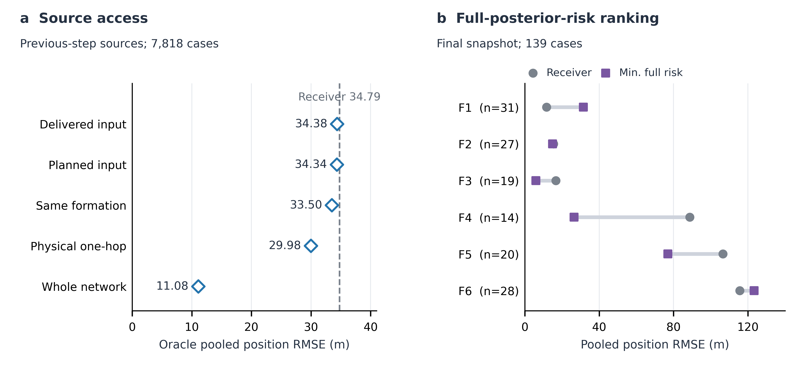

# V286：完整混合风险仍不足以可靠选源

## Question

V285 的协方差选源失败，是否主要因为只读取输出分量、遗漏其余 GM 模态？
这决定是否值得把“最小完整后验风险”接入跨编队消息动作。

## Scope

复用 V284 的 X36、seed 1301、第 40 步；保留 V285 在该帧全部 139 个新增
匹配案例，对应 326 个已输出完整对象。不重跑滤波、不传输消息，不改变
KLA、输出规则或性能门槛。来源必须具有相同标签。

## Risk Tier

L2 exploratory，self-check only，研究草稿。用于排除不充分的评分假设，
不构成在线方法、跨种子结论或新的最优策略。

## Claims

| ID | 发现 | 证据 | 边界 |
| --- | --- | --- | --- |
| C1 | 完整 GM 风险略好于分量迹，但仍伤害部分编队。 | E1, E2 | 单帧事后查询、来源免费可得，不是跟踪轨迹。 |
| C2 | 该帧多数被检查来源为单分量，遗漏其他模态不是主要解释。 | E2 | 256/273 个去重来源—真值位置对为单分量，不外推全部时间。 |
| C3 | 自身后验风险小，不足以说明来源可靠。 | E1--E3 | 下一设计需明确观测支持与时效，不是已建立的新评分器。 |

## Evidence Ledger

E1：以下命令执行完成，session 30254 正常退出 0：

```sh
octave --no-gui --quiet --eval "addpath(genpath(pwd)); analyzeFullMixtureSourceRiskV286('RUN/GA/dynamic_topology/evidence/tracking_aligned_v285/x36_same_label_spatial_availability_seed1301/SAME_LABEL_SPATIAL_AVAILABILITY_V285.mat');"
```

```text
V286 complete: 139 final-snapshot queries, 326 emitted full GM objects; no filter or candidate run.
global pooled RMSE: receiver 72.338283, oracle 28.936473, min-component 66.095875, min-full-risk 65.223646.
risk decomposition residual 6.13e-13; full-risk worsening fraction 0.3022.
```

E2：完整数值在 `evidence/tracking_aligned_v286/x36_final_snapshot_source_risk_seed1301/`。
CSV 保留五种来源池、六个编队聚合及去重来源的风险—误差描述。

| 接收编队，全网同标签来源 | 案例数 | 保持原输出 / m | 最小分量迹 / m | 最小完整风险 / m |
| --- | ---: | ---: | ---: | ---: |
| 全部 | 139 | 72.338 | 66.096 | 65.224 |
| 1 | 31 | 11.734 | 31.509 | 31.509 |
| 2 | 27 | 15.428 | 14.928 | 14.928 |
| 3 | 19 | 16.689 | 6.785 | 6.000 |
| 4 | 14 | 88.663 | 31.164 | 26.536 |
| 5 | 20 | 106.535 | 78.137 | 76.931 |
| 6 | 28 | 115.623 | 124.481 | 123.291 |

两种风险均不读取真值选源，均允许保留接收端。完整风险在 24/139 个案例中
改变选源，但编队 1/6 仍退化 168.533%/6.632%；总体改善 9.835% 不能掩盖
这些差异。此处是匹配位置平方误差的汇总根，不是官方平均逐节点—时刻
RMSE，也不能与 V285 的 40 步总体值直接相减。

273 个去重来源—真值位置对中，仅 17 个来自多分量对象。平均完整风险约
83,056 平方米，实际平方误差约 3,363 平方米；对数风险—误差相关系数约
0.334。共享观测和此前融合使其并非独立校准样本，不能据此断言风险普遍
过度自信或普遍保守，更不能按本帧拟合阈值。

E3：`common/computeGmOutputPositionRisk.m` 计算实际输出 a 对自身后验的
期望平方误差，由分量内协方差、分量间分歧和混合均值—输出偏移组成。
这是标准期望分解，不是新定理，也不能自动弥合后验风险与实际误差的差距。

## Verification Record

Self-check only。全部输出通过同标签、实际末次时间戳、完整均值/协方差
对应检查。按 `trajectoryLength` 读取时间，排除了 5 个旧归档对象。
直接求和与三项风险分解最大残差 6.13e-13。未做独立验证、真实传输、
递归集合效应或控制通信评估。

证据格式检查不是科学结论验证。执行
`python3 /Users/dex/.codex/skills/auto-research/scripts/evidence_lint.py RUN/GA/dynamic_topology/V286_FULL_MIXTURE_SOURCE_RISK_FINDING.md`
返回 `PASS: RUN/GA/dynamic_topology/V286_FULL_MIXTURE_SOURCE_RISK_FINDING.md`。

## Risk and Escalation

理想来源按真值挑选。某个均值恰好更近，不必然说明它携带更强、更及时的
观测证据。按低协方差直接转发可能伤害接收端，并在 KLA 中改变存在概率。
算法收益仍需可执行动作与同融合静态基线对照。

## Reproducibility

上述命令读取已存 MAT；评分函数、分析器、两个 CSV 和自动报告均保留。
完整 sourceRecords 位于本地 MAT。查看数值和重画图不需要重新生成场景。

重画命令：`/Users/dex/miniconda3/bin/python3 RUN/GA/plot_spatial_source_decision_v286.py`。
输出：`V286 source-decision figure exported: SVG, PDF, PNG; saved CSV inputs only.`

## Open Issues

轮末 GM 对象不提供完整的逐标签最近正测量支持时间。观测机会历史包含
漏检，不能充当新位置测量；无来源/时间语义的关联字段也不能改名为消息
新鲜度。理想位置改进是否伴随可识别的观测支持，仍须回答。

## Recommendation

不把完整风险单指标接入运行时，不启动全程实验或参数扫描。保留稀疏骨干，
下一候选需同时解释怎样保住目标存在信息、怎样让新增输出获得可靠的位置
更新。先检查理想好来源的本地正测量支持和时间信息，再设计跨编队传递；
不复活已失败的单包融合家族，也不直接添加 GNN。主文档只更新方法决策，
不添加失败候选或理想选源的最优方法行。

## Figure contract

Core conclusion：来源可用性与来源可识别性是两个问题。左图比较上一轮
预测来源的可用范围（7,818 案例），右图显示完整风险选源的编队差异
（第 40 步，139 案例）。二者不同样本，不作跨面板数值比较。

Quantitative grid，左图为主要诊断、右图为评分反证；Python/Matplotlib，
175 × 83 mm，白底、可编辑 SVG/PDF、600 dpi PNG。只用记录 CSV，
不平滑、不补样本、不添加伪误差条；单个开放种子，无显著性检验。
图留在实验记录，暂不进入论文主图或 Lark 最优表。



图：来源范围与选源可靠性。a，上一轮输出经一步常速预测，比较不同来源池
的理想同标签位置误差；虚线为保持接收端输出，菱形用真值选源并允许保持
原输出。b，第 40 步采用完整后验风险选源后，各编队的汇总位置误差；灰圆
为原输出，紫方为风险选源。两面板使用不同查询集合，不能直接比较数值。
所有数值来自同一个开放 X36 种子，无独立重复、误差条或显著性检验。

视觉自检：Python 导出图已查看，无标签遮挡或裁切；两面板明确区分时间
范围、案例数和理想选源，颜色同时配合不同点形。未把该图插入论文主图。
