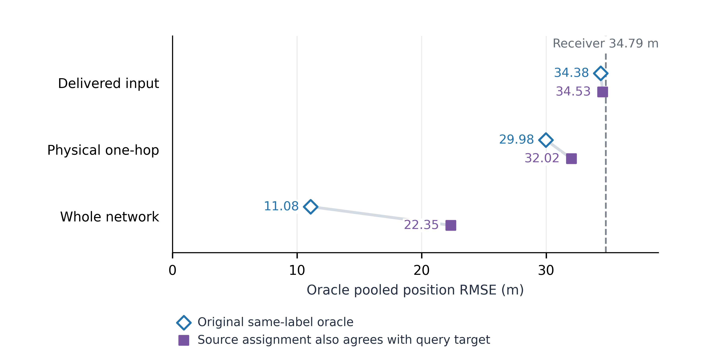

# V287：更近的同标签均值，不一定是更可信的同目标来源

## Question

V285 的理想选源空间是否依赖跨节点的目标对应不一致？这决定下一步应先
建立标签匹配基线，还是直接继续优化跨编队传输。

## Scope

复用 X36、seed 1301、前 40 步的 V242/V284 输出及 V285 全部新增匹配查询。
两组共 20,196 个已输出状态，新增查询 7,850 个；上一轮来源可用的查询为
7,818 个。不重跑滤波、不重建观测、不改标签、不执行选源或通信。

## Risk Tier

L2 exploratory，self-check only。用于限定后续方法设计；不是新算法收益、
身份切换率或完整跟踪验证。

## Claims

| ID | 发现 | 证据 | 边界 |
| --- | --- | --- | --- |
| C1 | 同标签的轮末输出并不总对应相同真值位置。 | E1, E2 | 几何对应受近距离目标与一对一指派竞争影响，不等于已确认的身份错误。 |
| C2 | 要求来源自身也对应查询目标后，理想选源空间明显缩小，但未消失。 | E1, E2 | 真值限制、免费来源、保留接收端，均不是可部署策略。 |
| C3 | 应把标签匹配作为需要补齐的融合基线，而非把它包装成路由创新。 | E3, E4 | 尚无标签匹配运行时实验，不能断言它会解决 X36。 |

## Evidence Ledger

E1：执行完成，session 83959，退出 0：

```sh
octave --no-gui --quiet --eval "addpath(genpath(pwd)); analyzeLabelIdentitySpatialHeadroomV287('RUN/GA/dynamic_topology/evidence/tracking_aligned_v285/x36_same_label_spatial_availability_seed1301/SAME_LABEL_SPATIAL_AVAILABILITY_V285.mat');"
```

```text
V287 complete: 20196 paired emitted states; 72.13% of added queries agree with birth identity.
Lag-1 global pooled RMSE: receiver 34.786640, original oracle 11.083094, assignment-coherent 22.349591, nearest-coherent 21.179909.
```

E2：结果目录为 `evidence/tracking_aligned_v287/x36_label_identity_spatial_headroom_seed1301/`。
三个 CSV 分别保留出生标签对应、跨节点对应分歧和来源限制后的全部分层。

| 上一轮输出经一步预测，7,818 个相同查询 | 保留接收端 / m | 原理想选源 / m | 来源一对一匹配也指向查询目标 / m | 来源最近真值也为查询目标 / m |
| --- | ---: | ---: | ---: | ---: |
| 全网同标签来源 | 34.787 | 11.083 | 22.350 | 21.180 |
| 物理一跳同标签来源 | 34.787 | 29.979 | 32.022 | 32.200 |
| 已投递入邻居的同标签来源 | 34.787 | 34.380 | 34.533 | 34.549 |

两种来源限制分别计算，不能混为经过验证的身份保证。表中是查询位置误差
平方的汇总根，不是主表的平均逐节点—时刻 RMSE。两种限制都使用来源自身
时刻的真值对应，再与接收端查询目标比较；不读取未来来源状态。来源状态
仍来自已完成的轮末输出，实际投递池只限制发送节点，并未证明这些状态
就是该轮发送前的包内容，也未计多跳传输时延与字节。

V284 全网同标签节点对有 47.23% 的一对一对应分歧；已投递边子集为
20.86%。最近真值分歧分别为 42.68% 和 17.76%。分歧时所对应真值位置的
平均间距约为 25.80 m / 21.63 m。不能只靠这些数字把问题归因于代码错误，
也不能以出生标签不同于真值序号直接认定标签融合无效：各节点一致的
共同重命名本身不破坏逐标签融合。真正要检查的是节点之间是否在融合
不同对象，以及这种情况是否造成可干预的损失。
本场景的共同出生标签在生成模型中已有一致含义。输出几何对应的分歧
不自动等于标签空间错配，也可能反映估计或关联不确定性；标签重匹配
因此是待检验对照，不是已确诊的代码修复。

E3：`multisensorLmb/fuseLmbPosteriorsByLabel.m` 按既有标签标识分组，当前
主对照没有先按空间密度重匹配标签。场景初始出生分量与显式轨迹一一对应，
但此约定不是整个递归过程中跨节点身份一致的证明。局部更新后的关联诊断
字段也不能直接当作融合后对象的新鲜来源信息：融合模板保留的字段没有
聚合来源及时间语义。

E4：[Li 等，IEEE TSP，2019](https://doi.org/10.1109/TSP.2018.2880704)
在标签匹配后进行逐标签 GCI；其匹配问题对 LMB 可转成线性指派。
[Gao 等，IEEE TAES，2022](https://doi.org/10.1109/TAES.2022.3182642)
同时处理不同视域与标签匹配，但采用约束最小信息损失准则，不能直接称为
现有 KLA 的同一实现。两篇书目信息由 Crossref 获取，主张核对到作者机构库
或出版社摘要；尚未取得 2019 正式论文全文。更早的
[GCI-LSM 作者原文](https://arxiv.org/html/1603.08336v1)可读取到式 (23)、
(30)--(33) 和算法 1，但其共同观测区域与未匹配轨迹处理不能直接移植到
当前有限视域场景。详见 `LABEL_MATCHING_BASELINE_NOTES.md`。

## Verification Record

Self-check only。已保存官方逐单元 RMSE 与重新几何指派的最大差为
1.42e-14，原 V285 理想误差重建差为 0。没有更改原 OSPA/RMSE 定义。
最近真值对应是对一对一指派竞争的补充检查，不是独立验证。
没有标签匹配后的递归跟踪结果，也没有证明标签分歧是当前误差的主因。

## Risk and Escalation

若把事后更近均值当作可靠同目标证据，可能继续追逐不可实现的通信收益。
反之，强行重匹配近距离目标也可能打乱正确轨迹；不能因 V287 就直接
重命名运行时标签。任何匹配实现需先说明未匹配标签、不同视域与跨时间
身份处理，再使用同路由配对实验评价。

## Reproducibility

分析入口、设计和 CSV 均保留，完整记录在本地 MAT。使用已保存结果执行
上述命令即可重建，不需要重跑 40 步滤波。Python 图只读取 headroom CSV。

## Open Issues

2019 标签匹配算法的完整实现细节尚缺；2016 原文不能替代正式方法的
未匹配标签约定。V287 没有按真实发送时刻检查包内容，也没有逐标签最近
正测量来源时间。单种子、40 步分析不代表全时域或 M24。

## Recommendation

依据 C1--C3，保留当前稀疏骨干与数值主表，不接入新的协方差评分、GNN
或真值身份门控。先建立来源清楚的标签匹配融合基线，并分别对照静态与
稀疏路由；融合修正的收益与路由收益必须分开。当前只把这一方法决策和
假设边界写入论文/主文档，不把本次理想误差列为新的最优方法。

## Figure contract

核心结论：跨节点几何对应约束会缩小理想选源空间；远处仍可能有帮助，
实际入邻居的改善空间却很小。单面板 quantitative grid，展示相同 7,818
个查询、三个来源池的原理想值与一对一对应受限值；最近真值敏感性结果
保留在表中。Python/Matplotlib，150 × 77 mm，白底、可编辑 SVG/PDF 与
600 dpi PNG；同一开放种子，无独立重复、误差条或显著性检验，不作平滑。
虚线为保持接收端。图留在实验记录，不替换已批准的主方法示意图。



图：相同查询上的来源范围与对应限制。空心菱形按真值选择更近的同标签
输出；实心方形额外要求来源自身的一对一几何指派也对应查询目标。两者
均允许保持接收端输出，均不是在线方法或实际通信结果。数值为汇总位置
RMSE，单个开放 X36 种子，前 40 步中的上一轮来源查询。

## Writing and figure handoff

重画命令为 `/Users/dex/miniconda3/bin/python3 RUN/GA/plot_label_coherence_headroom_v287.py`，
执行退出 0，输出 `V287 label-correspondence figure exported: SVG, PDF, PNG; 7,818 identical saved queries.`。
已查看最终 PNG，文字、点标记和轴线无遮挡或裁切；没有新增模拟样本。

新稿在 `papers/icassp2027/` 内执行 `tectonic main.tex`，退出 0。Python
读取确认仍为 5 页，结论完整位于第 4 页，第 5 页从声明与参考文献开始。
已逐页查看渲染；保留 underfull box 与重复 BibTeX rerun 警告记录，不把
编译成功当作投稿就绪。新增两篇经 Crossref 获取的文献，正文说明共享
出生标签不做空间重匹配，并避免将几何分歧说成已确诊的模型错误。

Lark 主文档局部更新并回读到 revision 1256：目前卡点、方法下一步、
相关工作与下一组对照设计已对齐。最优方法表、已批准的 SVG 画板及
既有性能数字均未修改。没有后台滤波任务。

证据格式命令
`/Users/dex/miniconda3/bin/python3 /Users/dex/.codex/skills/auto-research/scripts/evidence_lint.py RUN/GA/dynamic_topology/V287_LABEL_IDENTITY_SPATIAL_HEADROOM_FINDING.md`
返回 `PASS: RUN/GA/dynamic_topology/V287_LABEL_IDENTITY_SPATIAL_HEADROOM_FINDING.md`。
该检查只验证记录结构，不是独立科学验证。
