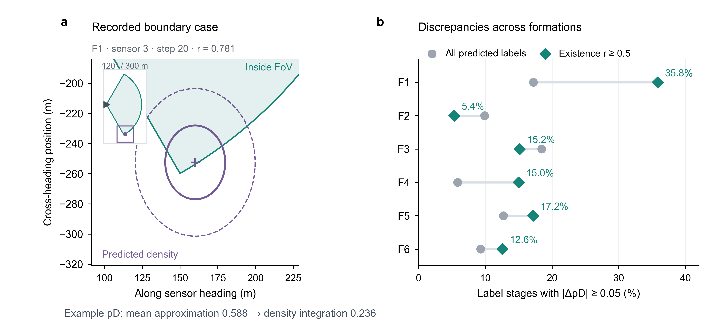

# V289: check the FoV likelihood before changing the fusion rule

## Question

Does the component-mean detection approximation materially misrepresent
the recorded predicted densities near finite-FoV boundaries? This is a
method-selection diagnostic, not another routing or tracking candidate.

## Scope

Read the saved V282 X36 prefix, seed 1301, steps 1--40. Retain every predicted
GM component, the existing 120-degree FoV, 300 m range, recorded sensor
headings and state-dependent detection quality. Do not regenerate the scene,
read target truth, rerun filtering, change weights or relabel tracks.

The fixed diagnostic compares mixture-weighted component-mean pD against
position-density integration using nested 2048/8192-point Halton rules.
Refine only the twelve largest pD discrepancies with 65536 points.
Report all stages, formations, high-existence stages (r >= 0.5), and
mean-pD-zero stages. A 0.05 absolute discrepancy is a descriptive materiality
level, not a tuned tracking acceptance threshold. Do not infer actual
tracking gains from the hypothetical isolated no-detection update.

## Risk Tier

L2 exploratory research; draft, self-check only. This can justify a bounded
baseline comparison, not a publication-performance claim.

## Claims

- C1: The current local update evaluates pD at Gaussian component means.
  This is a known approximation, not evidence of a newly introduced code bug.
- C2: Density-aware missed-detection updating changes both existence and
  the spatial density; changing only one scalar pD is incomplete.
- C3: Label partitioning alone does not define a new shared-label LMB MIL
  baseline when the input densities and source weights are unchanged.
- C4: The cached X36 densities show non-negligible pD approximation
  discrepancies, including high-existence label stages (E5). This is not a
  demonstrated cause of tracking loss or evidence of a successful remedy.

## Evidence Ledger

- E1: `common/evaluateSensorQuality.m`,
  `multisensorLmb/updateLmbWithSensorMeasurement.m:102` and
  `multisensorLmb/generateLmbSensorAssociationMatrices.m:87` directly show
  the geometry, quality and component-mean likelihood evaluation (C1).
- E2: LeGrand and Ferrari, *Split Happens! Imprecise and Negative Information
  in Gaussian Mixture Random Finite Set Filtering*, JAIF 17(2), 78--96 (2022),
  [author PDF](https://keithlegrand.com/wp/wp-content/uploads/2023/05/LeGrand-2022-Split-Happens-Imprecise-and-Negative-Information-in-Gaussian-Mixture-Random-Finite-Set-Filtering.pdf),
  Section IV, equations (8)--(12): mean-based FoV partitioning is approximate;
  boundary-aware GM splitting is an established alternative (C1--C2).
- E3: Gao et al., [accessible author version](https://arxiv.org/html/1911.01083v1),
  Proposition 3, Proposition 4 and Remark 6: LMB factors by label and uses
  arithmetic Bernoulli fusion under MIL. Keeping weights and inputs fixed,
  repartitioning by those labels merely repeats the existing rule (C3).
- E4: [2022 different-FoV author repository](https://flore.unifi.it/handle/2158/1275218)
  lists the accepted manuscript as closed; OpenAlex DOI metadata returned
  `oa_url: null` and `any_repository_has_fulltext: false`. This turn obtained
  no full 2022 text, so no detailed reproduction is inferred from its abstract.
- E5: The first Reproducibility command completed with exit 0 (session
  12482, 103.2 s numerical analysis): `MAE pD 0.022302, >=.05 4147/33786,
  zero-to>=.05 3189/27939, high-r material 1040/5950; max point check 3.33e-16`.
  The report, formation/time CSVs and twelve refined examples are under
  `evidence/tracking_aligned_v289/x36_prefix40_seed1301/`.
- E6: The figure export command below completed with exit 0 and reported
  `t=20, sensor=3, r=0.780674, pD 0.588192 -> 0.235517` for the largest
  high-existence discrepancy. Python drawing then completed with
  `V289 diagnostic figure exported; no main result or board replaced.`
  The image was visually inspected; the inset explicitly separates full-FoV
  geometry from the zoomed density. SVG text stays editable; PDF uses
  TrueType text and PNG is 600 dpi. One opened seed, no uncertainty bars.
- E7: `tectonic --keep-logs main.tex` in `papers/icassp2027` exited 0.
  Python PDF text inspection found five pages and 14 references; final
  conclusion is on page 4 and declarations/references start page 5.
  Changed pages 3--5 were rendered and inspected. The first longer wording
  displaced the conclusion to page 5; concise wording corrected this.
  Known underfull boxes and repeated BibTeX rerun warnings remain; no new
  missing-citation or overfull warning. No numerical main-table change.

## Completed result and decision

| Question | Cached-density result | Meaning |
| --- | --- | --- |
| How common is an absolute pD discrepancy >= 0.05? | 4,147 / 33,786 label stages, about 12.3% | Not a negligible corner case in this prefix. |
| Is it limited to low-existence priors? | 1,040 / 5,950 stages with r >= 0.5, about 17.5% | No; all six formations contain affected high-existence stages. |
| Does mean-pD-zero imply negligible observable mass? | 3,189 / 27,939 such stages have integrated pD >= 0.05 | No. The previous V282 zero-pD statement describes the implementation, not pointwise invisibility of the full density. |
| How sensitive is the numerical integral? | Mean/max 2048-to-8192 difference 0.000313 / 0.004231; top-twelve refinement max 0.000507 | Much smaller than the largest discrepancies; not a rigorous bound. |
| What happens in an isolated no-detection update? | Mean absolute existence change 0.001855; mean position change 3.567 m | Both pieces change; not the actual full measurement/association update. |

The strong-stage no-detection counterfactual has mean absolute existence
difference 0.006420 and mean position difference 1.283 m. Large mean-pD
errors therefore do not imply equally large count recovery, particularly
when existence is near zero or one. Improved boundary resolution may add
negative information to some tracks and remove excessive penalties from
others; its net tracking effect is not known.

Fifty of 33,786 stages change their >= 0.05 classification between the two
quadrature sizes. Report the percentages as approximate descriptive values,
not exact population parameters. Stages are dependent, not independent
replicates; the high-r subgroup is defined by stored predicted existence,
not true-target correctness.



Panel a shows the largest pD discrepancy among r >= 0.5 stages, not a typical
case. Sensor-aligned coordinates preserve distances and angles. The purple
cross is the predicted mean, not target truth; contours have Mahalanobis
radii one and two. The inset shows the complete 120-degree, 300 m FoV.
Panel b compares all predicted label stages with the r >= 0.5 subgroup;
denominators are retained in the formation CSV. Neither panel plots a
tracking improvement.

## Verification Record

Self-check only. The numerical diagnostic compares its vectorized point-pD
formula with the actual runtime evaluator at every component mean (maximum
difference 3.33e-16). Nested quadrature and top-case refinement check numerical
sensitivity, not independent scientific validation. No filter was rerun.
`/Users/dex/miniconda3/bin/python3 /Users/dex/.codex/skills/auto-research/scripts/evidence_lint.py RUN/GA/dynamic_topology/V289_FOV_DENSITY_DECISION.md`
returned `PASS: RUN/GA/dynamic_topology/V289_FOV_DENSITY_DECISION.md`;
this checks record structure only.

## Risk and Escalation

A visible approximation error is not proof that it causes X36's count deficit
or that repairing it will improve the joint goal. Splitting also increases GM
size, runtime and potentially posterior bytes. No new tracking arm is
authorized by this record's numerical observations alone.

## Reproducibility

From the isolated ICASSP worktree:

```sh
/opt/homebrew/bin/octave --quiet --eval "addpath(genpath(pwd)); [p,r]=analyzeFovDensityApproximationV289('RUN/GA/dynamic_topology/evidence/tracking_aligned_v282/x36_prefix40_seed1301/EXISTENCE_STAGE_TRACE_V282.mat','RUN/GA/dynamic_topology/evidence/tracking_aligned_v289/x36_prefix40_seed1301'); disp(p);"
```

The full per-label matrix stays in the local ignored MAT file. Formation/time
summaries and twelve refined cases are retained as small numerical CSVs.

Export and draw the selected example without redoing integration:

```sh
/opt/homebrew/bin/octave --quiet --eval "addpath(genpath(pwd)); exportFovDensityFigureDataV289('RUN/GA/dynamic_topology/evidence/tracking_aligned_v282/x36_prefix40_seed1301/EXISTENCE_STAGE_TRACE_V282.mat','RUN/GA/dynamic_topology/evidence/tracking_aligned_v289/x36_prefix40_seed1301/FOV_DENSITY_APPROXIMATION_V289.mat','RUN/GA/dynamic_topology/evidence/tracking_aligned_v289/x36_prefix40_seed1301/V289_BOUNDARY_EXAMPLE.json');"
/Users/dex/miniconda3/bin/python3 RUN/GA/plot_fov_density_diagnostic_v289.py RUN/GA/dynamic_topology/evidence/tracking_aligned_v289/x36_prefix40_seed1301
```

## Open Issues

No density-aware local update or complete unequal-FoV MIL implementation is
tested here. Quadrature differences are not rigorous error bounds. The
no-detection formula does not represent a measurement-associated LMB update.

## Recommendation

Do not launch a no-op label partition or rename it a novel method. C4 supports
a bounded FoV-aware local-update baseline, not another weight sweep. Preserve
the current sparse routing, physical scene and common labels. Any next
implementation must update the spatial density as well as existence, handle
boundary resolution before measurement association, and account for increased
GM size, actual posterior bytes and computation. Gaussian splitting is an
existing baseline technique, not the claimed novelty of a routing method.

Use saved comparable reference results; first establish the local/fusion
baseline effect under fixed routing. Only a same-fusion fixed-versus-dynamic
comparison can support a routing contribution. No new tracking run has
started in this turn, and the M24/X36 joint goal remains unmet. Keep these
diagnostics out of the main best-method table and preserve the approved board.
