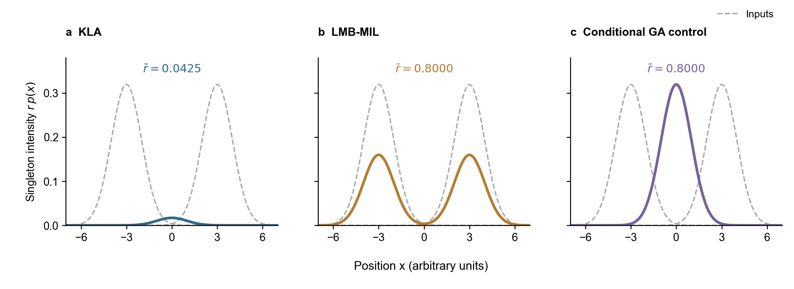

# V291: separate existence pooling from conditional spatial pooling

## Question

Does V288's conditional arithmetic spatial pool account for its localization
tradeoff, when existence aggregation, label semantics and routing are kept
as the same operators? V288 changed both parts relative to KLA. V290's
FoV-splitting arm has now failed its completed joint screen and stays off.

## Scope

One default-off receiver control, not standard LMB-KLA, not LMB-MIL, not a
reproduction of a published decoupled estimator, and not new routing.
Use the same X36 seed-1301, original-160-step scene cropped to 2/40 steps.
Reuse completed V242 and V288 metrics; filter only the new candidate.
Keep labels, observations, physical graph, delivery uniforms, filter RNG,
packet serialization, local update and posterior reduction limits unchanged.
No FoV splitting, learned weights, new label matching, extra control fields,
parameter sweep or automatic M24/full extension.

For one common label, write the input Bernoulli parameters as `(r_i,p_i)`
and the original normalized receiver weights as `w_i`. Absent labels have
`r_i=0`; their source weight is retained in the existence calculation.

\[
\bar r=\sum_i w_i r_i,\qquad
\alpha_i=\frac{w_i r_i}{\bar r},\qquad
\bar p(x)\propto\prod_{i:w_i r_i>0}p_i(x)^{\alpha_i}.
\]

For `rbar=0`, omit the Bernoulli. These are exactly the same existence rule,
zero extension and conditional weights as MIL, but a different spatial
pooling operator. This statement concerns the operators, not identical
intermediate inputs after recursive histories have diverged. Relative to
V242, the existence rule, absent-label semantics and spatial weights also
differ; it is not an isolated eta-removal ablation against KLA.

A precise, deliberately composite objective defines the ideal operator:

\[
J(r,p)=\sum_i w_i d_B(r_i\Vert r)
       +\sum_i w_i r_i D_{\rm KL}(p\Vert p_i).
\]

Here `d_B` is Bernoulli KL and `p` is a normalized conditional density.
The first derivative gives the weighted arithmetic existence probability.
For `rbar>0`, the second term is `rbar` times a reverse-KL centroid objective,
whose minimizer is the normalized geometric pool above. Unlike MIL, its
conditional KL direction is reversed. This is NOT the KL objective of the
complete Bernoulli/LMB density, and it supplies no truth-level accuracy,
whole-LMB cardinality-PMF consistency or standard-KLA guarantee.

The implementation reuses V242's guarded powered-GM spatial approximation:
three components per qualifying input, eight output components, 256 tuples,
and the existing moment-matched fallback/gates. For a single positive
conditional input, retain its GM with the same exact-copy coalescence and
eight-component reduction as MIL. Neither arbitrary GM powers nor component
reduction are exact. There is no spatial eta penalty on the arithmetic r.

## Risk Tier

L2 internal development, self-check only. The objective is a definition of a
controlled comparison, not a novelty or publication-readiness claim.

## Claims

- C1: V288 alone does not isolate arithmetic existence retention from its
  changed spatial pool (E1, E2).
- C2: Separating cardinality and localization is prior art, not our novelty
  (E3). V291 differs from that published method and is not its reproduction.
- C3: V291 changes the spatial-pooling operator relative to MIL at fixed
  existence/conditional-weight formulas; numerical approximation remains
  explicit (E2, E4).

## Evidence Ledger

- E1: `evidence/tracking_aligned_v288/x36_prefix40_seed1301/COMMON_LABEL_MIL_V288_REPORT.md`:
  E-OSPA 132.617637 versus 135.180030, RMSE 19.735674 versus 8.425317,
  attempted bytes 3.2474 times reference. Completed development tradeoff.
- E2: [Gao et al. author version, Proposition 3, equations 26--28](https://arxiv.org/html/1911.01083v1):
  MIL has arithmetic r and an arithmetic conditional density with weights
  proportional to `w_i r_i`. Re-read the actual formulas on 2026-09-06.
- E3: [Uney et al. author version, Section IV-A](https://arxiv.org/html/1802.06220v2):
  separate variational problems for cardinality and localization; the
  cardinality pool there is geometric, with independently optimized
  weights, not V291's arithmetic r. The paper also distinguishes density
  pointwise consistency from cardinality consistency. Final metadata was
  retrieved through DOI 10.1109/TAES.2019.2893083, TAES 55(6):2759--2773 (2019).
- E4: `multisensorLmb/fuseLmbPosteriorsByLabel.m`, option
  `arithmetic-existence-geometric-spatial`; runner
  `RUN/GA/runConditionalSpatialPoolV291.m` and focused formula check.

## Verification Record

Self-check only. Required before filtering: unequal-r Gaussian analytical
mean/covariance, same MIL arithmetic r, absent/disjoint labels, one-input GM
retention and an incompatible-weight guard. The first one-input comparison
used bitwise equality and exposed only a 5.55e-17 normalized-weight rounding
difference, with equal r/means/covariances; the assertion now uses 1e-12 for
weights, not a changed algorithm. Run the existing focused MIL check as well
to cover the unchanged default-KLA dispatch. No broad suite or hash audit.

The exact command below exited 0 on 2026-09-06 and printed both `V291 formula
self-check PASS` and `V288 formula self-check PASS`. These are focused
implementation self-checks, not an independent verifier or tracking result.

## Risk and Escalation

Two strong, disjoint modes can yield a strong geometric compromise where
neither source peaks. Keeping existence cannot guarantee correct positions.
Arithmetic r cannot exceed the strongest input and cannot create missing
evidence. Recursive effects and actual packet bytes must be measured.
Only a favorable joint screen permits considering same-estimator static
routing and subsequent scale/seed validation. A successful objective
derivation alone does not justify changing the paper's main method.

## Reproducibility

Freeze and push source before integration and the 40-step screen. From the
isolated worktree, run the candidate only:

```sh
/opt/homebrew/bin/octave --no-gui --quiet --eval "addpath(genpath(pwd)); checkConditionalSpatialPoolV291(); checkCommonLabelLmbMilV288();"
```

```sh
set -o pipefail
/opt/homebrew/bin/octave --no-gui --quiet --eval "addpath(genpath(pwd)); o=struct('baselineTracePath','RUN/GA/dynamic_topology/evidence/tracking_aligned_v282/x36_prefix40_seed1301/EXISTENCE_STAGE_TRACE_V282.mat','milSummaryPath','RUN/GA/dynamic_topology/evidence/tracking_aligned_v288/x36_prefix40_seed1301/COMMON_LABEL_MIL_V288.mat','maximumTime',40,'outputRoot','RUN/GA/dynamic_topology/evidence/tracking_aligned_v291/x36_prefix40_seed1301'); [p,r]=runConditionalSpatialPoolV291(o); disp(p);" 2>&1 | tee RUN/GA/dynamic_topology/evidence/tracking_aligned_v291/x36_prefix40_seed1301/run.log
```

For integration only, set T=2 and both summary/output directories to their
`x36_prefix2_integration_seed1301` counterparts. The runner generates all
160 steps before cropping. It saves raw output before scoring and reuses an
existing raw file; never restart a live/completed filter after a tool timeout.

## Open Issues

The 40-step screen is complete and did not pass the frozen RMSE tolerance.
Single-label r range preservation does not imply whole-LMB cardinality-
distribution consistency. No new routing, exact mixture-power implementation,
source-age model or generalization evidence has been established.

### Integration entry correction

Source `aaf6782` was committed and pushed before the first two-step attempt
(session 12847). The runtime validator rejected the unregistered fusion-rule
name before `Filter starting step 1/2`; exit 1, no raw filter result. The
existing V242 validator allowed KLA and V288 MIL only. Its explicit control
list now also registers V291, restricted to X36 seed 1301, T=2/40, the same
sparse route and no FoV splitting. This is not a disabled validator or
permission to change routing/truth/budget constraints. Preserve the rejected
log as `preflight-rejected.log`, then freeze the correction before retrying
integration. No performance metric or observation timeout triggered a retry.

### Completed integration and prefix

The corrected source `bf3dca0` was committed and pushed before integration.
Session 62648 exited 0. Its first filter step was at 09:50:03 local time on
2026-09-06; filter runtime was 21.5 s. E-OSPA was 139.697349 -> 139.289019,
RMSE 11.831774 -> 12.337711, attempted bytes 677584 -> 688168 (1.0156 times).
Attempted/delivered route-mask differences were 0/0 and all 72 RMSE cells
were finite. These two steps establish integration, not performance success;
they do not evaluate the frozen 40-step gate or motivate a parameter change.

The unchanged 40-step candidate completed as session 27392 (exit 0), from
source `bf3dca0`. It reached `Filter starting step 1/40` at 09:52:13 local
time on 2026-09-06, saved its raw output after 634.7 seconds of filtering,
then completed scoring. No filter was restarted while its scorer ran.
The report, CSVs and raw artifact are under
`evidence/tracking_aligned_v291/x36_prefix40_seed1301/`.

```sh
tail -f RUN/GA/dynamic_topology/evidence/tracking_aligned_v291/x36_prefix40_seed1301/run.log
```

### Completed result and decision

| Metric | V242 KLA | V291 | Change versus KLA |
| --- | ---: | ---: | ---: |
| E-OSPA / m | 135.180030 | 132.339041 | 2.102% lower |
| Common-finite RMSE / m | 8.425317 | 8.524262 | 1.174% higher |
| Absolute count error | 19.501389 | 18.684722 | 4.188% lower |
| Prefix representative disagreement / m | 144.669699 | 139.561394 | 3.531% lower |
| Attempted posterior bytes | 18,435,344 | 19,033,448 | 3.244% higher |

All 1,440 RMSE cells are finite in both arms; all 36 sensors and all six
formations improve E-OSPA. Attempted/delivered route-mask differences are
0/0, with the same 1,840/1,766 attempted/delivered messages. The frozen screen
fails only its network-mean RMSE tolerance: 1.174% exceeds 1%. Do not move
that threshold after observing the result. Formation RMSE still matters:
formations 1 and 4 worsen by about 9.34% and 13.27%, respectively. The small
average difference does not imply spatially uniform performance.

Relative to V288 MIL, the conditional geometric operator reduces RMSE from
19.735674 to 8.524262 m and attempted bytes from 59,867,264 to 19,033,448;
E-OSPA is also slightly lower. This controlled recursive comparison supports
separating existence and spatial pooling when interpreting MIL's tradeoff.
It does not isolate a single intermediate covariance, truncation event or
target-identity error, nor establish the composite objective as novel.

Retain V291 as a useful development control, not a validated replacement.
No automatic M24/full episode, threshold relaxation or nearby-parameter
sweep. The next completed analysis uses existing scenes to distinguish
binary temporal paths from their packet-level mixing weight (V292); it
does not run another tracking arm or alter the paper's best-method table.

## Recommendation

One candidate only. Report the V288 comparison to interpret spatial pooling,
but make the deployment screen against the same V242 reference: E-OSPA gain
at least 1%, lower count error, non-worse prefix representative disagreement,
common-finite RMSE degradation at most 1%, every formation's E-OSPA degradation
at most 1%, attempted bytes at most 1.05 times reference and route-mask
differences 0/0. Two steps are integration only; freeze these criteria before
the 40-step run. Failed/mixed numerical results stay out of the main table.

## Figure contract

An analytic three-panel comparison shows `r*p(x)`, not tracking accuracy:
KLA, MIL and the conditional geometric control for two equally weighted
single-Gaussian inputs with r=0.8, means -3/+3 and variance 1. It must show
that retained existence plus a concentrated position is not proof of a
correct target location. No ground-truth marker, seed, error bar or empirical
result is invented. Python/matplotlib only; 178 by 65 mm, shared axes,
editable SVG/PDF, 300-dpi PNG and numerical CSV. Keep it in experiment/design
notes, not the main paper or the already-approved Lark board.

Generated with `/Users/dex/miniconda3/bin/python3 RUN/GA/plot_conditional_spatial_pool_v291.py` using
the selected Python backend. It returned r=0.042545438 for KLA and 0.8 for
MIL/control. The PNG was visually checked for common axes, readable labels,
no overlap and no hidden truth/accuracy ranking. The PDF and editable SVG
use the same source. This figure is exact for the analytic single-Gaussian
inputs, unlike the runtime's arbitrary-mixture approximation.


