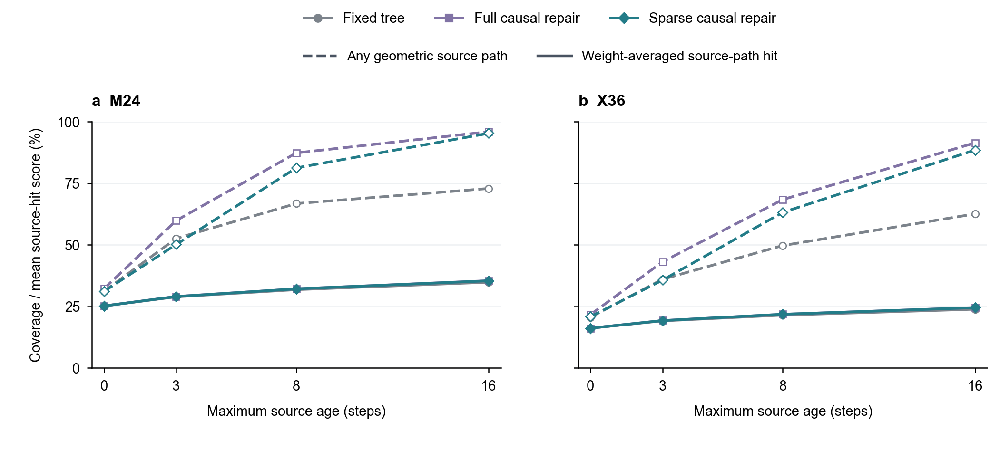

# V292: weighted observation transport, without another tracker run

## Question

Does binary temporal reachability conceal weak weighted access to recent
observations in the already-opened M24/X36 episodes? The decision is whether
transport strength remains a plausible bottleneck, not which weight to use.

## Scope

Reuse V280's geometric visibility, activity and path ages for seed 1301.
Replay the unchanged fixed, full causal and sparse causal policies using the
original scenario generator and directed packet uniforms. The generator is
needed to preserve its RNG sequence; no filter or tracking scorer is run.
Truth is confined to the cached offline observer and never enters a policy.
Report every existing horizon: maximum ages 0, 3, 8 and 16 steps.

For one target, let `o_k` indicate geometric observation opportunity and let
`W_k` be the delivered packet-level row-stochastic matrix, using the existing
missing-packet renormalization. Within a window `max(1,t-h):t`, start at zero:

\[
z_k=W_k\{o_k+(1-o_k)\odot z_{k-1}\}.
\]

This is a backwards-source-path hitting probability: sample a pre-fusion
sender using the receiver's row of W; stop successfully at an observation
opportunity, otherwise continue through that sender's previous state.
One synchronous round follows the current local observation opportunity.
Binary path coverage asks whether any such path exists; the weighted score
averages over paths according to their actual packet-level mixing weights.

It is not actual posterior mass, label recall, detection probability,
mutual information, a tracking-error bound or a new theoretical result.
Empty packets, active-label weights, local likelihoods, overlap, pruning and
association are omitted. Visibility also does not guarantee detection.

## Risk Tier

L2 internal mechanism analysis, self-check only. No new control or deployed
recommendation. Any paper use must retain the packet-level limitations.

## Claims

- C1: V280's binary path indicator and a weighted path score answer different
  questions. Positive score should reproduce binary reachability (E1, E2).
- C2: A weak score would motivate studying useful information transfer, not
  conclude that stronger generic mixing improves tracking (E3).

## Evidence Ledger

- E1: `evidence/tracking_aligned_v280/observation_reachability_seed1301/OBSERVATION_REACHABILITY_V280.md`.
- E2: `RUN/GA/analyzeWeightedObservationTransportV292.m`; reports and source
  CSV are generated under `evidence/tracking_aligned_v292/weighted_observation_transport_seed1301/`.
- E3: `V220_SCALE_AWARE_EDGE_VALUE_ROUTING_DESIGN.md`, V27 stronger-mixing
  controls: old-scene negative evidence, not an exclusion for every new scene
  or estimator. V291 independently tests a different spatial pooling rule.

## Verification Record

Self-check only. Check row sums, probability range and exact correspondence
of positive-score masks to V280 path ages, plus route message counts. These
are focused orientation/timing checks; no broad audit or hash validation.
The two-source recursion directly follows the law of total probability.

The command below completed with exit 0 from source `ae81dcc` on 2026-09-06.
All probability/mask/count assertions passed for both scenes, three policies
and four horizons. The Python export completed, and its PNG was visually
checked: common axes, no clipping, readable legends and deliberately nearly
overlapping weighted-score curves. Source CSV and editable vectors accompany
the figure. These are producer self-checks, not independent validation.

Package check: `/Users/dex/miniconda3/bin/python3 /Users/dex/.codex/skills/auto-research/scripts/evidence_lint.py RUN/GA/dynamic_topology/V292_WEIGHTED_OBSERVATION_TRANSPORT_DESIGN.md`
returned `PASS` on 2026-09-06. This checks record structure, not the scientific
validity of the diagnostic or the success of a tracking method.

## Risk and Escalation

Calling this score an actual fusion coefficient or a detector probability
would misrepresent the approximation. Do not select thresholds, tune routing
or promote tracking gains from these post-hoc values.

## Reproducibility

```sh
/opt/homebrew/bin/octave --no-gui --quiet --eval "addpath(genpath(pwd)); analyzeWeightedObservationTransportV292();"
```

The script saves the realized matrices and the eight-step score to permit
follow-up analysis without regenerating observations. Figures use Python
and the exported CSV only.

## Figure contract

Conclusion to examine: binary source-path coverage can rise while the
weight-averaged probability of encountering such a source remains lower.
This is an access diagnostic, not an estimator-performance figure. The
two panels compare M24 and X36 on identical axes, with the same three
policies and all four horizons. No panel introduces another parameter.

Archetype: compact quantitative pair. Python/matplotlib only, 178 by 82 mm,
editable SVG/PDF and 300 dpi PNG; restrained method colors plus distinct
markers, dashed binary coverage versus solid weighted score. Source data:
`V292_TRANSPORT_METRICS.csv`. One opened episode per scale; averages over
active sensor-target-time triples are descriptive, not independent
replicates. No error bars, p-values or across-seed claim.

Caption: **Geometric paths and weighted access to recent observations.**
(a) M24 and (b) X36 use the same opened seed and 160-step scene as the main
development comparisons. Dashed lines show the fraction of active
sensor-target-time triples with at least one geometric source path. Solid
lines show the mean probability that a backwards source path sampled using
delivered packet-level fusion weights encounters an observation opportunity
within the same age window. Visibility is not realized detection; these
scores omit label-specific filtering and do not measure tracking accuracy.
Windows are shortened at the start of the episode.

```sh
/Users/dex/miniconda3/bin/python3 RUN/GA/plot_weighted_observation_transport_v292.py
```

## Open Issues

Source-hit scores ignore all label-specific estimator dynamics and cannot
resolve their causal role. We have not intervened on fresh-evidence weight
while controlling density compatibility and source duplication.

## Recommendation

The completed eight-step results are:

| Scale | Policy | Binary path coverage | Mean weighted source-hit score |
| --- | --- | ---: | ---: |
| M24 | Fixed tree | 66.777% | 31.807% |
| M24 | Full causal repair | 87.337% | 32.142% |
| M24 | Sparse causal repair | 81.261% | 32.129% |
| X36 | Fixed tree | 49.716% | 21.459% |
| X36 | Full causal repair | 68.388% | 21.805% |
| X36 | Sparse causal repair | 63.183% | 21.806% |

Binary coverage improves much more than this weighted diagnostic. At X36,
even the full route's 18.672 percentage-point coverage increase corresponds
to only about 0.346 points of mean source-hit score. Full and sparse repair
have similar mean weighted scores despite different message counts. This
does not mean their actual label posteriors or tracking outputs are equal.
Nor does it imply an 8-step-old observation is accurate or independent.

Together with V291's completed mixed result, narrow the design question to
how useful fresh evidence should influence a receiver without spreading
spatial conflicts or repeatedly reusing the same information. Retain the
sparse backbone as the communication scaffold. Generic mixing strength,
binary reachability and fusion-objective substitution are not sufficient
method-selection criteria. Do not start another weight sweep or claim a
new source-aware policy has already been implemented.


