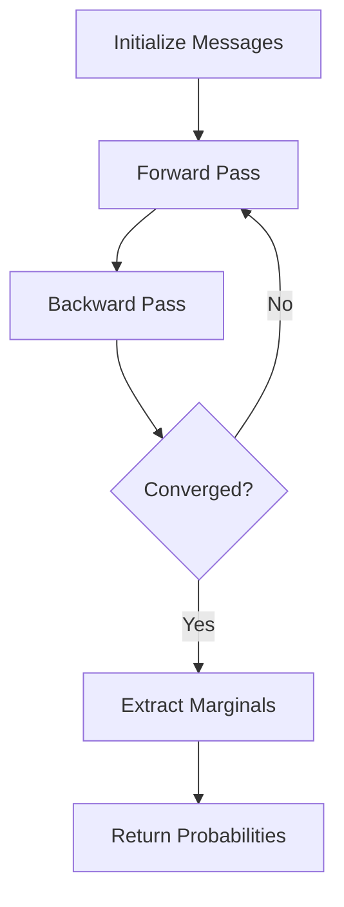
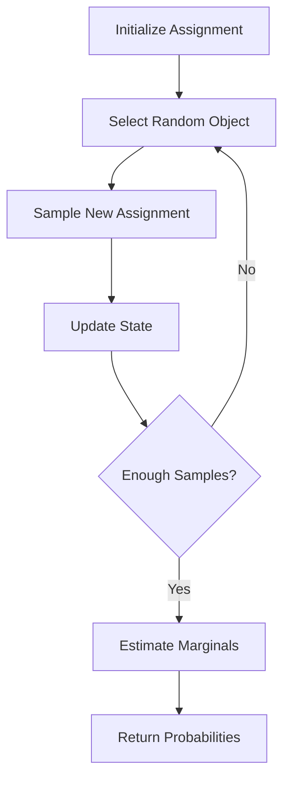
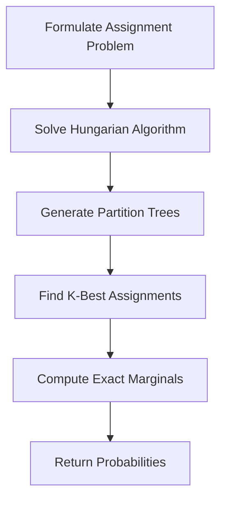
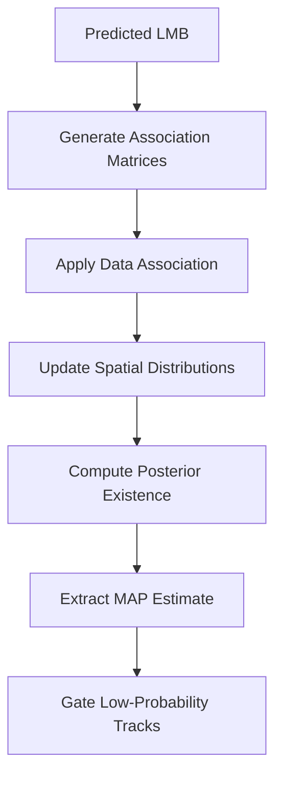

# Algorithm Documentation

## Overview

This document provides detailed explanations of the core algorithms implemented in the Multi-sensor LMB Filters project.

## Data Association Algorithms

### 1. Loopy Belief Propagation (LBP)



**Algorithm Description:**
The LBP algorithm operates on a factor graph representation of the data association problem. It iteratively passes messages between variable nodes (objects) and factor nodes (measurements) to approximate marginal probabilities.

**Key Features:**
- Computationally efficient O(NM) complexity
- Good approximation quality for most scenarios  
- Recommended for real-time applications
- May not converge in highly ambiguous scenarios

**Implementation Details:**
```matlab
function [r, W] = loopyBeliefPropagation(associationMatrices, tolerance, maxIterations)
    % Initialize message vectors
    phi = associationMatrices.phi;
    eta = associationMatrices.eta;
    Psi = associationMatrices.Psi;
    
    % Iterative message passing
    for iter = 1:maxIterations
        % Update object-to-measurement messages
        % Update measurement-to-object messages
        % Check convergence
        if converged
            break;
        end
    end
    
    % Extract marginal probabilities
    r = computeObjectExistenceProbabilities(messages);
    W = computeAssociationProbabilities(messages);
end
```

### 2. Gibbs Sampling



**Algorithm Description:**
Gibbs sampling is a Markov Chain Monte Carlo (MCMC) method that samples from the posterior distribution of data associations by iteratively updating each assignment variable.

**Key Features:**
- Asymptotically exact for infinite samples
- Good for uncertainty quantification
- Moderate computational complexity
- Requires burn-in period for convergence

**Sampling Strategy:**
1. Initialize random valid assignment
2. For each object, sample new assignment given all others
3. Collect samples after burn-in period
4. Estimate marginals from sample frequencies

### 3. Murty's Algorithm



**Algorithm Description:**
Murty's algorithm finds the K-best assignments in a linear assignment problem, providing exact marginal probabilities for the top-K solutions.

**Key Features:**
- Provides exact solutions within top-K assignments
- Higher computational complexity O(K·N³)
- Excellent for benchmarking other methods
- May miss probability mass in long tail

## Multi-Sensor Fusion Algorithms

### 1. Parallel Update (PU-LMB)

**Mathematical Foundation:**
The PU-LMB filter factorizes the multi-sensor likelihood as:

$$L(Z_1,\ldots,Z_s|X) = \prod_{i=1}^{s} L(Z_i|X)$$

**Algorithm Steps:**
1. Apply each sensor's measurement update independently
2. Combine posterior distributions multiplicatively
3. Normalize and extract final estimates

**Advantages:**
- Mathematically rigorous under independence assumption
- Highly parallelizable
- Most accurate among approximate methods

### 2. Geometric Average (GA-LMB)

**Fusion Formula:**

$$p_{GA}(x) = \frac{\prod_{i=1}^{s} p_i(x)^{w_i}}{Z_{GA}}$$

Where $w_i$ are sensor weights and $Z_{GA}$ is normalization constant.

**Characteristics:**
- Excellent for localization accuracy
- Poor cardinality estimation
- Robust to sensor correlations
- Geometric mean preserves mode structure

### 3. Arithmetic Average (AA-LMB)

**Fusion Formula:**

$$p_{AA}(x) = \sum_{i=1}^{s} w_i \cdot p_i(x)$$

**Characteristics:**
- Better cardinality estimation than GA
- Maintains full Gaussian mixtures
- Higher computational cost
- Good for heterogeneous sensors

## State Estimation Procedures

### LMB Prediction Step

```mermaid
sequenceD diagram
    participant P as Previous LMB
    participant B as Birth Process
    participant S as Survival Process
    participant N as New LMB
    
    P->>S: Apply Survival Probability
    B->>N: Add Birth Components
    S->>N: Add Survived Components
    N->>N: Predict State Forward
```

**Mathematical Model:**

- **Survival:** $r_{k+1|k}^{-} = p_s \cdot r_k$
- **Birth:** Add new Bernoulli components
- **State Prediction:** $\mu_{k+1|k} = F \cdot \mu_k$, $\Sigma_{k+1|k} = F \cdot \Sigma_k \cdot F^T + Q$

### LMB Update Step



**Update Equations:**
- **Existence Update:** Based on detection/missed detection events
- **Spatial Update:** Kalman filter update for associated measurements
- **Mixture Management:** Pruning and merging of Gaussian components

### MAP Cardinality Estimation

The MAP cardinality estimator solves:

$$\hat{n} = \arg\max P(N = n | Z_{1:k})$$

**Algorithm:**
1. Rank objects by existence probability
2. Find cardinality maximizing joint probability
3. Select top-n objects for state extraction

## Performance Optimization Strategies

### Computational Complexity Analysis

| Algorithm | Time Complexity | Space Complexity | Accuracy |
|-----------|----------------|------------------|----------|
| LBP | $O(NM \cdot I)$ | $O(NM)$ | High |
| Gibbs | $O(NM \cdot S)$ | $O(NM)$ | Very High |
| Murty | $O(K \cdot N^3)$ | $O(K \cdot N^2)$ | Exact |

Where:

- $N$ = number of objects
- $M$ = number of measurements  
- $I$ = LBP iterations
- $S$ = Gibbs samples
- $K$ = number of assignments

### Memory Management

**Track Gating:**
```matlab
% Remove tracks with low existence probability
keepTracks = [objects.r] > model.existenceThreshold;
objects = objects(keepTracks);
```

**Mixture Reduction:**
```matlab
% Prune low-weight Gaussian components
for i = 1:length(objects)
    keepComponents = objects(i).w > model.weightThreshold;
    objects(i).w = objects(i).w(keepComponents);
    objects(i).mu = objects(i).mu(keepComponents);
    objects(i).Sigma = objects(i).Sigma(keepComponents);
end
```

### Parallel Processing Opportunities

1. **Independent Sensor Updates:** Multi-sensor measurement updates
2. **Gaussian Component Updates:** Spatial distribution calculations  
3. **MCMC Chains:** Multiple Gibbs sampling chains
4. **Hypothesis Evaluation:** LMBM hypothesis processing

## Convergence and Stability

### LBP Convergence Criteria

```matlab
function converged = checkLbpConvergence(messages_old, messages_new, tolerance)
    relative_change = norm(messages_new - messages_old) / norm(messages_old);
    converged = relative_change < tolerance;
end
```

### Gibbs Sampling Diagnostics

**Burn-in Detection:**
- Monitor assignment probability convergence
- Use Gelman-Rubin diagnostic for multiple chains
- Check autocorrelation decay

**Effective Sample Size:**
```matlab
function ess = effectiveSampleSize(samples)
    autocorr = autocorrelation(samples);
    tau = 1 + 2 * sum(autocorr(1:end-1));
    ess = length(samples) / tau;
end
```

### Numerical Stability

**Log-Space Computations:**
```matlab
% Avoid underflow in probability calculations
log_weights = log(weights);
max_log_weight = max(log_weights);
normalized_weights = exp(log_weights - max_log_weight);
normalized_weights = normalized_weights / sum(normalized_weights);
```

**Covariance Matrix Conditioning:**
```matlab
% Ensure positive definite covariance matrices  
function Sigma_reg = regularizeCovariance(Sigma, min_eigenvalue)
    [V, D] = eig(Sigma);
    D = max(D, min_eigenvalue * eye(size(D)));
    Sigma_reg = V * D * V';
end
```

## Error Handling and Robustness

### Common Failure Modes

1. **Matrix Singularity:** Regularize covariance matrices
2. **LBP Non-convergence:** Increase iteration limit or use damping
3. **Gibbs Poor Mixing:** Adjust proposal distribution or increase samples
4. **Memory Overflow:** Implement track pruning and mixture reduction

### Graceful Degradation

```matlab
function [r, W] = robustDataAssociation(associationMatrices, model)
    try
        % Attempt primary algorithm
        [r, W] = loopyBeliefPropagation(associationMatrices, model);
    catch ME
        warning('LBP failed, falling back to Gibbs sampling');
        [r, W] = lmbGibbsSampling(associationMatrices, model);
    end
end
```

## Advanced Features

### Adaptive Parameter Selection

**Dynamic LBP Iterations:**
```matlab
function iterations = adaptiveLbpIterations(scenario_complexity)
    base_iterations = 100;
    complexity_factor = scenario_complexity.objects * scenario_complexity.measurements;
    iterations = min(base_iterations * log(complexity_factor), 1000);
end
```

**Gibbs Sample Sizing:**
```matlab
function samples = adaptiveGibbsSamples(association_ambiguity)
    base_samples = 1000;
    ambiguity_factor = 1 + association_ambiguity;
    samples = base_samples * ambiguity_factor;
end
```

### Multi-Model Extensions

The framework supports extension to:
- Jump Markov systems (multiple motion models)
- Extended object tracking (shape estimation)
- Group target tracking (formation tracking)
- Non-linear measurement models (particle filter integration)

## References and Further Reading

1. **LBP Algorithm:** Williams, J.L. (2015). "Marginal multi-Bernoulli filters"
2. **LMB Theory:** Vo, B.-N., & Vo, B.-T. (2013). "Labeled random finite sets"  
3. **Multi-sensor Fusion:** Chong, C.-Y., & Kumar, S.P. (2003). "Sensor networks"
4. **MCMC Methods:** Gilks, W.R., et al. (1995). "Markov Chain Monte Carlo in Practice"
