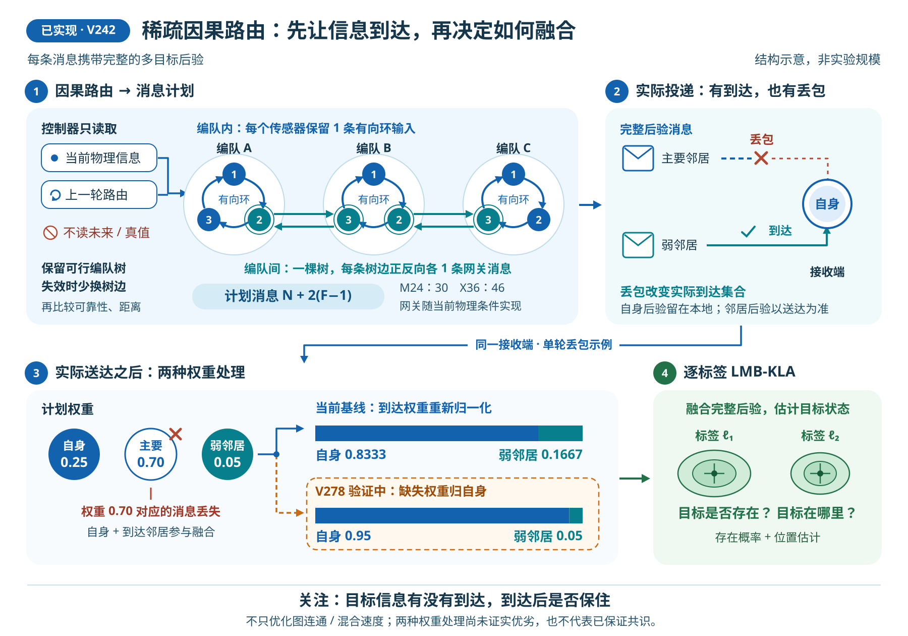
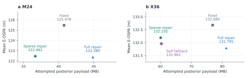

# 通信受限下的稀疏动态多目标跟踪

更新：2026-09-06；目标：ICASSP 2027。

## TL;DR

多编队传感器需要交换目标判断，但运动会改变邻居关系，链路也会丢包。我们的主线是：**以因果修复维持稀疏通信骨干，让有限通信同时支撑目标存在判断与可靠的位置更新。** M24/X36 的后验发送字节分别减少 10.0%/21.8%，但整体 E-OSPA 仅改善 2.40%/0.37%；自身权重回填也未解决精度与一致性的取舍。当前缺口是完整目标集合的恢复，不能用已匹配目标的定位改善代替。局部视域细分对照已完成，但没有解除这一缺口，不启用该版本。下一项受控比较保留相同的目标存在判断，只改变位置分布的合并规则，分清两者的作用后再研究消息时效与字节预算。这不改变动态路由的研究问题，也不把已有融合思想当成创新。新稿已有两张矢量图、完整主表和相关工作比较；尚未建立满足联合目标的新方法，现有性能结果仍是单种子开发证据。

## 背景与研究问题

每个传感器只能看到有限区域。目标离开一个编队、进入另一个编队时，原来的观测信息需要及时传递，才能让其他节点继续判断目标是否存在、位于何处。固定路由的优点是开销可控，但它可能在编队移动后失效；使用更多通信边能增加可用信息，也会反复传输体积不小的目标后验。

LMB 同时描述目标的存在概率和空间分布。KLA 通过加权几何平均融合不同节点的判断，空间分布是否相容也会影响融合后的存在概率。因此，路由设计不能只追求少连边或更快达成一致：还要看融合之后是否保住目标、是否得到更准确的位置。

当前研究问题收束为：**在移动编队、有限视域和有向丢包条件下，怎样选择并执行一张低通信开销的动态图，使有限轮 LMB-KLA 的目标集合估计保持有效？** “full/light 等价”已经退出主线。现有数值实现使用保留混合分量的 powered-GM 近似，并不把任意高斯混合的幂视为精确闭式解。

## 方法设计：保留一个骨干，研究一个明确缺口

设计分成两层：已实现的稀疏因果路由决定“谁给谁发”，接收规则处理“原定输入没到时怎么办”。自身权重回填已完成 X36 单种子对照，表现为精度与一致性的取舍，尚未成为跨尺度验证过的改进。图中三个编队只是结构示意，不代表 M24 或 X36 的实际规模。

**当前要补齐的环节。** 基础通路不等于有用信息已经送到，还要区分信息在本地怎样形成、在接收端怎样融合、又通过什么路线传递。局部视域边界细分已完成 X36 前 40 步对照，但未解决数量、定位和通信的联合目标，不启用或扩展该版本；详细数值留在[实验记录](../../RUN/GA/dynamic_topology/V290_FOV_SPLITTING_DESIGN.md)。这说明该局部修正还不足以改善当前递归跟踪，不能推广成“准确视域建模没有价值”。

**下一项只比较位置合并规则。** 先固定路由、局部观测更新和共享标签。对“这个目标是否存在”，保持 MIL 的加权平均；对“它在哪里”，分别比较保留多个位置候选和几何融合。两种方法使用同样的存在判断和条件权重公式，但后续递归输入可以因位置更新不同而分化。几何融合也可能在两个相互冲突的位置之间形成错误的中间估计，所以它只是有明确数学定义的对照，不是已经证明有效的方法，也不是标准 LMB-KLA。[对照设计](../../RUN/GA/dynamic_topology/V291_CONDITIONAL_SPATIAL_POOL_DESIGN.md)

把目标数量与位置分开处理已有理论基础：[Üney 等，TAES，2019](https://doi.org/10.1109/TAES.2019.2893083)明确区分并分别融合两类分布。这里的对照不等于该论文的完整算法，更不能把“分开处理”本身列为创新。只有局部更新与融合规则相同，静态和动态路线的差别才能归因于路由。下图继续只展示已实现骨干和接收规则对照。

**已经实现的骨干。** 每个编队内部保留一条有向环，编队之间用一棵生成树连接，每条编队树边配置正反向各一条网关消息。前一轮的编队树仍能通过当前网关实现时继续使用；失效后，优先替换最少的编队边，再按当前可靠性和距离选择。保留的是编队级连接结构，传感器网关端点仍按当前物理条件实现，不是锁死整张传感器路由。只使用当前物理信息和已有编队树，不使用未来轨迹或目标真值。

有 N 个传感器、F 个编队时，这种结构每步安排 N+2(F−1) 条后验消息：M24 为 30 条，X36 为 46 条，完整两输入动态参考分别为 48 和 72 条。这是所选“本地环＋双向编队树”结构的精确计数，不是所有通信图的全局最小值。物理可行时可以证明计划图强连通，但不能据此保证丢包后的图也强连通。

**已完成的接收规则对照。** 主动删除一条本地冗余边时，现有策略会把省下的权重归还自身；意外丢包时，默认实现却把剩余输入重新归一化。假如原来权重为 0.70 的主要邻居掉线，剩下一个权重为 0.05 的邻居，它的权重可能被放大到 0.1667。V278 保持拓扑不变，让缺失权重也回到自身，从而保持其他邻居的原定权重。该规则也适用于空邻居输入，但不改变逐标签缺失处理。

这条规则不增加消息或控制字段，但递归后验的大小仍可能变化。X36 对照中，它相对原稀疏骨干改善了 E-OSPA、数量误差和焦点一致性，却使条件 RMSE 退化 4.836%，最受影响编队的 RMSE 退化 37.361%。因此它只保留为当前取舍记录，不升级为统一替代规则，不继续参数扫描。

**暂时收起的分支。** GNN、真值教师驱动的网关排序、逐标签捷径和仅以混合速度为目标的轮换策略，不进入当前主方法。已有窗口实验说明“更一致”和“目标估计更好”可能冲突；仅靠重新评分网关，尚未形成可稳定推广的收益。学习方法以后只能在确定性方法成立后承担一个有清晰训练目标的局部决策。

## 当前最优记录与必要对照

下表均为 160 步、seed 1301、temporal-coupled formation-braid 的同场景配对结果。四项指标均越低越好；通信量为尝试发送的后验字节，包含丢失的传输，不包含路由控制流量。MB 按十进制计算。各尺度独立比较，不把一个种子的结果当作统计显著性。

| 场景 | 方法 | E-OSPA / m | 条件位置 RMSE / m | 焦点窗口一致性 / m | 后验发送 / MB | 计划消息 / 步 |
|:--|:--|--:|--:|--:|--:|:--|
| M24 | 固定编队树 | 125.478 | 22.640 | 133.599 | 40.769 | 46–48 |
| M24 | 完整因果修复 | **122.380** | 14.081 | 131.913 | 44.867 | 48 |
| M24 | 最小因果骨干 V242 | 122.462 | **12.183** | **131.664** | **36.676** | 30 |
| X36 | 固定编队树 | 132.680 | 36.925 | 139.407 | 76.871 | 66–72 |
| X36 | 完整因果修复 | **131.795** | 19.586 | **139.004** | 81.259 | 72 |
| X36 | 最小因果骨干 V242 | 132.192 | **19.329** | 140.489 | **60.090** | 46 |
| X36 | 最小骨干＋自身权重回填 V278 | 131.961 | 20.263 | 139.273 | 60.317 | 46 |

| 当前候选相对本尺度固定树 | E-OSPA 改善 | 条件 RMSE 改善 | 焦点一致性改善 | 后验字节减少 | 最弱编队 E / RMSE 改善 |
|:--|--:|--:|--:|--:|:--|
| M24 最小骨干 | +2.403% | +46.190% | +1.449% | +10.041% | +0.272% / **−24.085%** |
| X36 最小骨干 | +0.368% | +47.655% | **−0.776%** | +21.830% | −0.818% / +4.444% |
| X36 最小骨干＋自身回填 | +0.542% | +45.124% | +0.096% | +21.535% | −1.155% / −4.079% |

M24 最小骨干是当前网络均值上最均衡的方法，但个别编队的定位误差仍明显退化。X36 没有一项方法在所有指标同时占优：原最小骨干的通信量和条件 RMSE 最低，完整因果修复的 E-OSPA 和焦点分歧最低；自身回填则在四项网络均值相对静态路由均改善的同时保留较低通信量，但整体收益仍小且局部尾部退化。主文档持续保留这些数值，不把单种子结果写成稳定泛化。

图 a、b 比较同一尺度内的通信量与 E-OSPA，越靠左下越好；两图的纵轴范围不同。M24 的稀疏方案以较低通信量接近完整动态路由的集合误差，X36 的集合误差差距更大。每个点是一次已完成的配对开发实验，没有跨种子误差条；条件 RMSE、一致性和编队尾部仍需一起看上表，不能仅凭这两个坐标指定全面最优方法。图 c 补充了下一节的定位改进上界：如果输出目标数量不变，M24/X36 的平均 E-OSPA 最多再减少 0.279/1.311 m。这是解析上界，不是已经取得的新收益。

这里的 RMSE 只统计成功匹配的目标位置，不能单独代表完整目标集的质量。X36 的平均目标数量绝对误差为：固定树 18.456、完整修复 18.463、最小骨干 18.597。最小骨干的 RMSE 大幅下降伴随目标数量误差增加，所以不能写成“整体跟踪提升近一半”。焦点一致性使用每个编队一个固定代表节点，在 t=40–140 计算，也不能泛化成所有节点的全时域一致性。

## 为什么下一步优先处理目标存在信息

对已保存结果的误差分解表明，当前整体误差主要来自估计目标数量与真实数量不符，而不是已输出目标的位置不够准。下表固定每个“传感器—时刻”的估计目标数，计算把定位误差理想地降到零后，还能减少多少平均 E-OSPA。它给出的是改进空间的上限，不是新方法的实验收益。

| 当前最小骨干 | 目标数量项占平方 E-OSPA 的比例 | 当前平均 E-OSPA | 仅改善定位最多还能降低 |
|:--|:--|--:|--:|
| M24 | 99.567% | 122.462 m | 0.279 m |
| X36 | 98.074%–99.337% | 132.192 m | 至多 1.311 m |

M24 的数量项可以由现有记录确定；X36 有 121/5760 个单元无法唯一判定估计目标数偏多还是偏少，因此保留上下界。以上百分比是平方误差的占比，不是平均 E-OSPA 的线性拆分；目标数不足也不意味着每一个已输出目标都是正确目标。这个结果说明：要让 E-OSPA 获得明显收益，方法需要改变目标集合的恢复与保留情况，单纯继续压低位置 RMSE 的空间已经很小。

X36 的位置改善仍然存在，但应配合覆盖范围理解：最小骨干有 97.465% 的单元能计算 RMSE，固定树为 100%。限制在双方都能计算 RMSE 的同一批单元后，最小骨干为 19.329 m、固定树为 31.394 m，改善 38.431%，而非原始非配对均值给出的 47.655%。这一比较只对齐了传感器和时刻，不保证匹配的是相同目标身份。

V278 已完成，但没有解决这个缺口：数量误差虽从 18.597 降到 18.518，仍高于静态路由的 18.456。下一步应区分“有效信息没有到达”和“到达后存在概率在融合中下降”，再决定路由或接收规则怎么改；不再仅凭计划连通性、双随机性或更快混合选择新候选。[误差分解记录](../../RUN/GA/dynamic_topology/evidence/tracking_aligned_v279/set_error_budget_seed1301/SET_ERROR_BUDGET_V279.md)

新的观测—传播分析进一步收窄了问题：M24/X36 全网络无人可见的目标—时刻仅占 2.773%/2.734%，平均每个节点直接可见约 4 个目标，但全局有 16/24 个目标。假设几何可见就能得到完美观测、消息到达后永久保留信息，原稀疏骨干在 8 步内具有观测来源路径的目标比例为 81.261%/63.183%；完整修复为 87.337%/68.388%。这说明规模增大会加重传播时延，且不能只靠全局视域覆盖解释输出目标少的问题。这里计算的是理想通信机会，不是实际标签召回率；还不能直接认定损失发生在融合内部。[观测与传播记录](../../RUN/GA/dynamic_topology/evidence/tracking_aligned_v280/observation_reachability_seed1301/OBSERVATION_REACHABILITY_V280.md)

**已有缓存进一步说明，不能先把问题归咎于最后一次融合或输出门槛。** 在 M24 的三个已保存时刻，对融合前的局部后验按现有规则读取，平均已经只有约 6 个目标估计。收到的标签标识约有 15–16 个，但在考虑空间相容性之前，其加权存在概率总量就已较低；最后这次空间融合只进一步减少 0.10–0.22，剪枝减少得更少。

| 时刻 | 融合前局部后验的 MAP 数量 | 空间相容性项之前的存在概率总量 | 融合之后 | 最终输出数量 |
|--:|--:|--:|--:|--:|
| 70 | 5.958 | 6.042 | 5.923 | 6.000 |
| 84 | 5.917 | 6.001 | 5.776 | 5.833 |
| 151 | 6.542 | 6.592 | 6.493 | 6.667 |

表中均为 24 个接收节点的平均值。标签不是经过真值匹配的目标，存在概率总量也不是召回率；它只是把同一次融合的输入加权和空间影响分开观察。尚未输出的低概率标签仍保留在内部后验中，不能等同于被输出步骤删掉。这三个时刻尚未追踪此前的局部更新和多轮传播，不能单独外推到 X36，也不能排除空间不相容在更早时刻反复累积的损失。[三时刻分析与方法决策](../../RUN/GA/dynamic_topology/V281_EXISTENCE_LOSS_LOCALIZATION_FINDING.md)

**X36 的新发现：有过观测信息来源，不等于当前判断足够强。** 现已完成原 X36 实验前 40 步的逐环节记录，没有修改感知条件、路由或滤波规则。实现中检测概率为零的标签，其局部存在概率保持不变至数值精度。这里的“零”按高斯分量均值计算，不代表整个位置分布都在视域外；后续密度积分已显示两者可能不同，不能把这一记录当成视域近似准确的证明。第 40 步在最后一次融合之前，局部后验平均已只输出 5.806 个估计；融合之后为 5.861 个，弱状态并不只出现在最终输出环节。

我们另外记录每个保留标签是否曾经接触过观测机会，包括本地更新和实际参与融合的邻居输入。漏检也包含在内，所以这个标记只说明有过信息来源，既不保证发现过真实目标，也不表示信息现在仍然可靠。

| 需要区分的现象 | 前 5 步 | 第 36–40 步 | 对方法的启示 |
|:--|--:|--:|:--|
| 从未接触观测机会的输入，占负向加权存在证据的比例 | 89.860% | 0.937% | 未更新的先验在启动阶段很突出，但不能仅用它当前的直接影响解释后期弱状态。 |
| 加权后存在概率低于 0.5，且没有任一输入达到 0.9 的情况 | 3,667 / 3,756 | 3,117 / 3,227 | 后期约 96.6% 的弱输入组合里，本来就没有达到这一强度的输入可供融合。 |

表中 0.5/0.9 只用于描述输入，不是输出阈值或新方法参数；比例统计的是标签融合事件，不是真实目标召回。第 36–40 步，当前没有观测机会的输入仍占约 79.5% 的权重，其中许多已经有历史信息来源，因此不能简单删除所有当前视域外输入。同时，晚期先验占比低也不能排除启动阶段留下的长期影响。后续配对干预已表明，排除未更新先验仍不足以同时解决集合恢复与新增目标定位；具体候选数值继续保留在实验记录中，不加入最优方法表。

方法设计由此进一步收束为：**保留稀疏骨干，把注意力转向有用观测证据经过多跳之后还能保留多少，以及新证据怎样及时替换过时判断。** 不能只传播“曾经收到过”的标记，也不能一律偏向高存在概率，因为未检测到目标同样可能是有效证据。下一项候选需要明确来源、时效、重复信息处理和新增通信成本，再做配对实验；这仍是设计方向，不是已经获得收益的新算法。[X36 分析与方法决策](../../RUN/GA/dynamic_topology/V283_OBSERVATION_EVIDENCE_FINDING.md)

## 理论部分现在能写到哪里

可以写清并证明骨干的计划强连通性和精确消息数；还可以在“固定输入、共同正支撑、精确几何融合”的条件下，分析丢失权重如何扰动有限轮融合结果。新稿给出了这一条件性敏感度界，并明确它不直接适用于包含新观测、混合截断与标签删减的完整递归滤波。

投递回放进一步显示，M24/X36 最小骨干的实际消息图分别仅在 41/160 和 18/160 步保持强连通。X36 计划权重有 22/160 步不满足双随机，而按实际投递重新归一化后为 143/160 步。这里仍未计入空后验与逐标签筛选，不能直接称为逐标签有效图。正反向共用网关也无法消除独立丢包的影响，因此不把“权重平衡”包装成已经证明的无偏共识保证。

目前理论的作用是厘清问题和约束方法；真正需要补强的贡献，是让投递感知设计形成稳定的通信—估计质量收益。通用矩阵扰动界本身不应被夸大成新的估计最优性理论。

## 与已有动态网络和多视域跟踪工作的区别

动态调整通信图并不是空白方向。Ramachandran 等人的多机器人多目标跟踪工作已经在传感器质量下降时，联合调整通信拓扑和融合权重，并进一步调整机器人位置改善覆盖。因此，“动态拓扑”“少改几条边”本身都不能单独作为本稿的新颖性。[作者论文](https://arxiv.org/abs/2004.07197)

我们的实验固定编队运动，不通过移动节点修复感知条件；约束的是每步传输后验的稀疏消息预算，并考察有向丢包和有限轮 LMB 融合怎样共同影响目标集合。现阶段已建立通信收益及其边界，尚未建立稳定的集合估计优势。真正需要完成的差异化贡献，是让有限通信保住有用的目标存在信息，而不只是让计划图保持连通。这项比较已写入新稿，未将尚未实现的改动写成方法贡献。

多视域融合本身也不是空白。此次核对后，新稿明确区分下面三类工作，避免把现有代码的一条视域规则误写成某篇论文的完整方法。

| 代表工作 | 已有思想 | 与当前实现的关系 |
|:--|:--|:--|
| [G. Li 等，Signal Processing，2020](https://doi.org/10.1016/j.sigpro.2019.107246) | 将 GM-PHD 分成簇，在共同视域融合，并补偿共同视域之外的信息。 | 这是 PHD 方法，不是 LMB；当前代码没有实现其完整聚类与补偿流程。 |
| [S. Li 等，FUSION，2018](https://doi.org/10.23919/ICIF.2018.8455250) | 研究不同视域下的 LMB 融合，包含集中式和节点间协作情形。 | 不能把“让 LMB 适应不同视域”本身作为新贡献；完整方法仍需进一步复现比较。 |
| [Wang 等，Signal Processing，2018](https://doi.org/10.1016/j.sigpro.2018.04.010) | 在集中式多视域 LMB 中，按每个标签的信息量调整融合权重。 | “信息多的标签获得更大权重”已有先例；我们需要证明稀疏有损多跳传播带来的新问题及解决效果。 |

当前代码的相关处理更有限：邻居缺少某个标签时，结合其视域决定是否把这个缺失作为负面信息；若标签仍存在但概率很低，它不会仅因当前不可见而被排除。所有主对照共享这条规则，但它不等于上述任一完整多视域算法。后两篇目前核对到官方摘要或引言，尚未完成算法级复现，不能宣称已经与它们做过严格对照。

局部视域更新也有已有方法。[LeGrand 与 Ferrari，JAIF，2022](https://arxiv.org/abs/2207.11356)通过细分视域边界附近的高斯分量，改进“没有检测到目标”对位置分布的更新。当前接入的是这类方法在现有局部更新中的对照，不改变传感器视域，不额外获得观测，也不将分量拆分本身列为创新。它与不同节点之间怎样融合仍是两个问题。

融合准则和标签对应是两类基线。[Li 等，TSP，2019](https://doi.org/10.1109/TSP.2018.2880704)先匹配各节点的标签，再逐标签 GCI；[Gao 等，TSP，2020](https://doi.org/10.1109/TSP.2020.3028496)给出 LMB 的最小信息损失融合，其可读取的[作者原文](https://arxiv.org/html/1911.01083v1)也明确设置未匹配目标的代价，而非强制两边一一配对。[Gao 等，TAES，2022](https://doi.org/10.1109/TAES.2022.3182642)则是不同视域与标签匹配的相关基线。这些已有思想都不能算作我们的创新。

当前已按原文公式接入共享标签的 MIL 对照：缺失标签补为零存在概率，完整拼接空间混合分量、合并完全相同的分量，再按原 8 分量上限截断并记录损失。这既改变融合准则，也明确改变缺失标签处理，不能把效果全归给去掉空间重叠项。它不是完整的不同视域或标签匹配方法；X36 的 40 步配对已完成，但未达到联合目标，详细数值仅保留在[实验记录](../../RUN/GA/dynamic_topology/V288_RUN_STATUS.md)，不扩展该版本。[解析示意图与基线说明](../../RUN/GA/dynamic_topology/LABEL_MATCHING_BASELINE_NOTES.md)用于解释两种规则的区别，不作为跟踪收益。

## 下一步与论文安排

| 顺序 | 要回答的问题 | 执行与判断 |
|:--|:--|:--|
| 已完成 | 丢包后的权重放大是否值得修正？ | X36 单因素全程实验完成：回填改善 E-OSPA 和一致性，但定位退化超出原定 1% 容忍度；不启动该规则的 M24 扩展或参数扫描。 |
| 已完成 | 弱存在状态是否只来自最后融合或未更新先验？ | M24 三时刻和 X36 前 40 步均已有记录；X36 后期弱输入组合仍大量存在，但从未接触观测机会的先验已很少。启动阶段影响、历史衰减和空间项累计作用尚未因果分离。 |
| 已完成 | 更换融合准则能否同时改善数量和定位？ | 保留共享标签与稀疏路由的 LMB-MIL 前缀对照已完成，但未解决联合目标，不扩展此版本。详细数值仅留实验记录，不改动最优方法表。 |
| 已完成 | 局部视域近似是否妨碍数量与位置的共同恢复？ | 同观测、同路由的 40 步边界细分对照已完成，未解决联合目标；保持关闭，不扩展到 M24 或全程。详细数值仅留实验记录。 |
| 当前 | 存在判断相同时，位置合并方式有什么作用？ | 新增默认关闭的受控融合选项：保留 MIL 的存在平均、缺失标签处理和条件权重，只替换位置分布的合并规则。先短集成，再做冻结的 X36 40 步配对；不把它称为标准 KLA 或新路由。 |
| 此后 | 有限视域下应保留什么证据，真实字节预算如何约束？ | 区分局部观测与不同节点间的融合，再比较独有视域证据的处理；不能把消息条数等同于字节预算，也不因 MIL 对照未通过就认定需要重命名标签。 |
| 此后 | 空间重匹配是否必要，路由贡献还剩多少？ | 匹配需单独检验并明确未匹配目标、不同视域和跨时间身份处理，不按真值重命名。只有在相同融合准则下比较静态与稀疏路由，才能归因于路由；不把已有 MIL 或匹配方法当成创新。 |
| 基线明确后 | 怎样让有用观测及时到达？ | 区分本地新位置观测、漏检与历史混合信息，明确来源、时间及重复利用，再设计有预算约束的跨编队传递；比较集合误差、定位、数量、一致性、通信和编队尾部。 |
| 方法冻结后 | 能否复现并推广到另一种布局？ | 先补 M24 配对，再固定方法做新种子和交替并线场景；该场景已完成几何实现与可视化，尚无跟踪效果结论。 |
| 写作并行 | 论文有没有一条能独立阅读的论证？ | 新模板独立成稿；背景、已实现方法、条件性分析、三臂主表和限制已写入。后续结果原位更新，不引入旧版 full/light 叙事。 |

新稿题目暂定为 *Delivery-Aware Sparse Causal Routing for Distributed Multi-Object Tracking*。作者为 Jinhao Chen、Tianyu Wo，机构为 Beihang University，通讯作者为 Tianyu Wo。没有外部资助，全体作者无利益冲突。

官方常规论文截止日期为 2026-09-16，技术内容最多 4 页，可增加符合要求的第 5 页。当前交付的是可继续迭代的研究稿；多种子、跨布局验证、控制通信成本和方法新颖性定位仍需补齐。[官方 Paper Kit](https://cmsworkshops.com/ICASSP2027/papers/paper_kit.php)

数据来源：[M24 全程记录](../../RUN/GA/dynamic_topology/evidence/tracking_aligned_v248/m24_temporal_task_coupled_formation_braid_seed1301/TEMPORAL_TASK_COUPLED_FORMATION_BRAID_V248_FULL_EPISODE.md)；[X36 全程记录](../../RUN/GA/dynamic_topology/evidence/tracking_aligned_v274/x36_minimum_backbone_seed1301/CROSS_SCALE_MINIMUM_BACKBONE_V274_FULL_EPISODE.md)；[实际投递回放](../../RUN/GA/dynamic_topology/evidence/tracking_aligned_v277/packet_weight_realization_seed1301/REALIZED_KLA_BALANCE_V277.md)。
