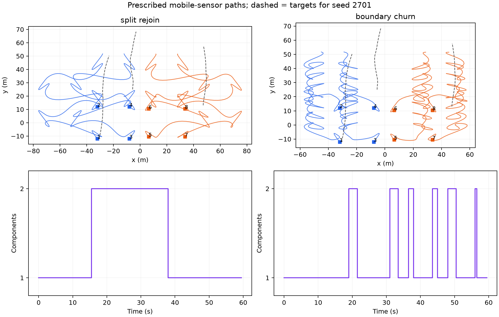
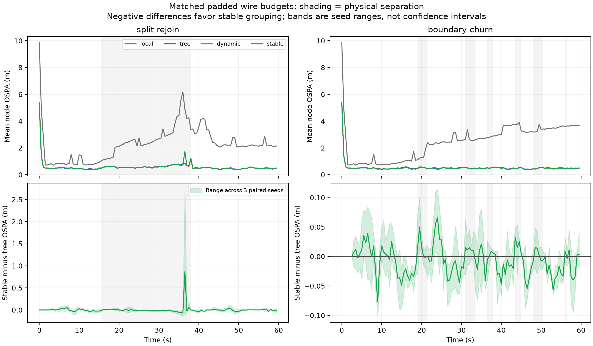

# 动态分组跟踪预实验：第一轮结果

2026-09-07，`codex/icra`。已完成 2 个场景 × 3 个配对种子 × 4 个方案，共 24 次完整 LMB 跟踪运行。协议在完整实验前固定，未按结果调整参数。

**判断：工程上可行，作为论文主贡献的效果信号目前偏弱。动态分组略优于普通时变通信树，但稳定分组没有带来额外、可重复的精度优势。暂不建议扩大规模或搜索参数。**

## 实验设置与完成范围

- 8 个移动节点，120 帧，0.5 s/帧；预设平滑二维路径，传感器身份永久固定。
- 分队后汇合：45 帧处于两个四节点分量，38 s（第 77 帧）重新连通。
- 通信边界反复进出：22 帧不连通，发生 6 次重新连通，时刻为 21.5、33.5、38、45、50.5、56.5 s。
- 节点最大速度分别 7.40、7.06 m/s；离散速度差估计的最大加速度为 2.63、5.08 m/s²。它们是运动学机制路径，未实施控制器、动力学或整段扫掠碰撞验证。
- 60 m 通信半径，90 m 圆形视野，检测率 0.9、位置噪声标准差 1 m、每节点每帧平均 1 个杂波、独立有向丢包率 0.1。
- 复用原 LMB 预测、LBP 观测更新和 mixture-aware KLA 近似融合；每帧一轮，所有接收者消费同一批融合前后验，没有瞬时多跳。
- 四个固定出生区域提供宽先验，实际有三个目标；真值初始偏移和观测由种子生成，未提供给滤波器。只在第一帧出生，不覆盖持续新生、任意进入视野的新目标或独立标签对齐问题。
- 三个通信方案保持每帧相同消息条数和 8192 字节固定包长，包含显式计费的协调控制开销。本地组无通信。

`tree` 每帧重建各物理分量的最小生成树；`dynamic` 每帧重建最多三人的几何小组，再连接组内/组间树；`stable` 保留合法成员关系，失效时拆分，新合并要求跨组链路连续存在三帧。组间物理通信会立即接通，不等待成员合并。稳定策略只作用于分组，组内外树仍按当前几何重新计算。



## 主要结果

OSPA 为位置误差与数量误差的集合指标，单位 m，越低越好；表中为三个种子的均值 ± 样本标准差。全部节点、全部帧及三个真值目标均纳入统计，断网期间不删除难目标。

| 场景 | 本地 LMB | 普通时变树 | 直接动态分组 | 稳定动态分组 |
|---|---:|---:|---:|---:|
| 分队后汇合 | 2.295 ± 1.071 | 0.579 ± 0.082 | **0.573 ± 0.080** | 0.581 ± 0.092 |
| 边界反复进出 | 2.442 ± 0.845 | 0.532 ± 0.058 | **0.524 ± 0.059** | 0.525 ± 0.059 |

普通通信融合已经明显优于本地估计。直接动态分组相对树的均值改善约 1.09% 和 1.50%；稳定策略在分队场景反而略差于树（约 0.30%），边界场景比树低约 1.31%。稳定策略相对直接动态分组的平均误差在两个场景都略高。

为避免用总体平均掩盖种子差异，下面列出稳定策略减去树的配对平均 OSPA 差值，负值有利于稳定策略：

| 场景 | seed 2701 | seed 2702 | seed 2703 |
|---|---:|---:|---:|
| 分队后汇合 | −0.00155 | +0.01398 | −0.00729 |
| 边界反复进出 | −0.00764 | −0.00570 | −0.00753 |

边界场景的方向在三个种子中一致，但绝对差异只有约 0.006–0.008 m。三个种子不足以声称统计显著性，也不能证明跨场景优势。

| 场景 / 指标 | 本地 | 树 | 动态 | 稳定 |
|---|---:|---:|---:|---:|
| 分队：数量 MAE | 0.05035 | 0.00278 | 0.00278 | 0.00313 |
| 边界：数量 MAE | 0.06632 | 0.00243 | 0.00243 | 0.00243 |
| 分队：每帧最差节点 OSPA 的时间均值 | 6.5546 | 0.9685 | 0.9502 | 0.9965 |
| 边界：每帧最差节点 OSPA 的时间均值 | 9.8945 | 0.8634 | 0.8458 | 0.8508 |

分队场景下，稳定方案还出现了少量额外数量误差及更高的最差节点均值。因此不能只引用它减少换组的结果来宣称整体更稳健。



上图阴影为物理网络分离区间；下图色带是三个配对种子的取值范围，不是置信区间。保留分队场景的局部误差峰值，没有裁去不利片段。

## 减少换组不等于减少链路变化或改善任务

“成员关系编辑”统计节点对是否同组的变化，和组编号无关；不是换组人数或消息数。路径固定，所以这类几何计数不随观测种子变化。

| 场景 | 动态成员关系编辑 | 稳定成员关系编辑 | 树的链路编辑 | 动态的链路编辑 | 稳定的链路编辑 |
|---|---:|---:|---:|---:|---:|
| 分队后汇合 | 14 | 6 | 52 | 30 | 40 |
| 边界反复进出 | 92 | 16 | 52 | 58 | 56 |

稳定方案减少了约 57% 和 83% 的成员关系编辑。但其实际链路编辑并未同比下降；分队场景甚至比直接动态分组更多。这解释了为什么“组更稳定”未必直接产生更好的融合路径。这里只是由统计支持的解释，没有做逐链路误差归因。

## 通信与重连结果如何解读

| 场景 | 三个通信方案的总计费流量 / 次运行 | 树的未填充后验 | 动态的未填充后验 | 稳定的未填充后验 |
|---|---:|---:|---:|---:|
| 分队后汇合 | **各 12.539 MiB，完全相同** | 2.933 MiB | 2.992 MiB | 2.979 MiB |
| 边界反复进出 | **各 12.898 MiB，完全相同** | 3.008 MiB | 3.160 MiB | 3.141 MiB |

未填充后验为三个种子的均值。总流量含每次运行 0.117 MiB 的控制开销，失败发送也计费。所有后验均真正序列化为字节，再从包中还原接收输入；固定包剩余部分填零。这是模拟协议的计数，不是部署网络的测量。

这证明第一轮差异没有来自多发消息或占用更多固定包时隙，但不能声称动态分组提高了无填充协议的字节效率：其未填充后验体积略大于树。组协调由掌握全体当前几何的中央计算器完成，控制信道可靠且带外，收发分别按每节点每帧 64 字节计费；未实现丢包条件下的分布式组协商。

重连后的前十帧（在再次断开时截断）平均 OSPA：

| 场景 | 树 | 动态 | 稳定 |
|---|---:|---:|---:|
| 分队后汇合 | 0.5840 | 0.5617 | 0.5691 |
| 边界反复进出 | 0.4775 | 0.4656 | 0.4654 |

三个通信方案在所有种子、全部 7 个重连事件中，都在重连起点满足“连续五帧网络平均 OSPA ≤5 m”的预设条件，恢复延迟均记为 0。**因此本轮恢复时间指标没有区分力，不能据此说稳定分组恢复更快。** 未事后收紧阈值来制造排名。

这个局限与场景有关：目标已在起始阶段被广泛观测、运动较平滑、没有新的出生和复杂交叉关联，即使分离也没有严重丢失全网目标。这轮证明了持续运行和状态继承，尚未充分激发“分裂后局部信息缺失、汇合后需要补回”的困难。

## 下一步取舍

不建议立即把“几何分组＋稳定机制”定为 ICRA 方法主线。它目前最明确的收益是成员关系变化减少，任务指标不足以支撑独立主贡献。

若继续，应先提出并验证一个更具体的机制问题：分离期间两队获得不同的新信息后，重连时哪些信息值得交换，以及几何相近是否等于融合有用。可以为此单独预注册一个存在局部新目标或真实观测空缺的诊断，先验证普通树确实存在可解释的困难，再判断分组是否是解决工具。不要只把噪声调大、阈值改紧来追求现有候选的优势；也无需马上引入学习算法或完整机器人控制。

这是后续建议，本轮没有追加调参或第二批跟踪实验。是否继续该机制方向，应该由独立问题价值和新实验信号决定；当前结果不足以否定所有动态分组方法。

## 验证与复现

- MATLAB 每帧检查物理边、分量连通、相同消息预算、归一权重、永久目标标签、有限后验、正定协方差、包尺寸和字节往返还原。
- Python/SciPy 另行用保存的真值和估计集合重新解最优指派，复核全部 **23,040 个节点帧**的 OSPA、数量误差、条件匹配平方误差及匹配数，与 MATLAB 结果一致。
- 模型、真值、原始观测、丢包随机数、拓扑和全部估计都保存在六个 `results/*_full.mat` 中；逐节点帧 JSON 压缩保存为 `*_full.json.gz`。`summary.json` 包含逐种子结果、尾部误差、匹配支持、流量和恢复事件。
- 实验没有修改 `common/`、`lmb/` 或 `multisensorLmb/` 的原函数。初始化短程检查只验证管线，未用于调参；短程输出不纳入正式结果。

从仓库根目录运行：

```text
matlab -batch "addpath('trials/icra_group_tracking'); runGroupTrackingPilot('full');"
python trials/icra_group_tracking/analyze_results.py
```

Python 依赖 NumPy、SciPy、Matplotlib；脚本兼容前一 WHALES 实验的 `tmp/whales_deps`。`geometry` 模式只检查拓扑，`smoke` 模式每场景运行一个种子的前四帧。原始完整实验基于父提交 `54b82e50` 的公共函数；本目录的源码散列见 `source_sha256.json`。完整运行后只增加输出压缩与报告，没有改变算法参数或重新选择结果。
