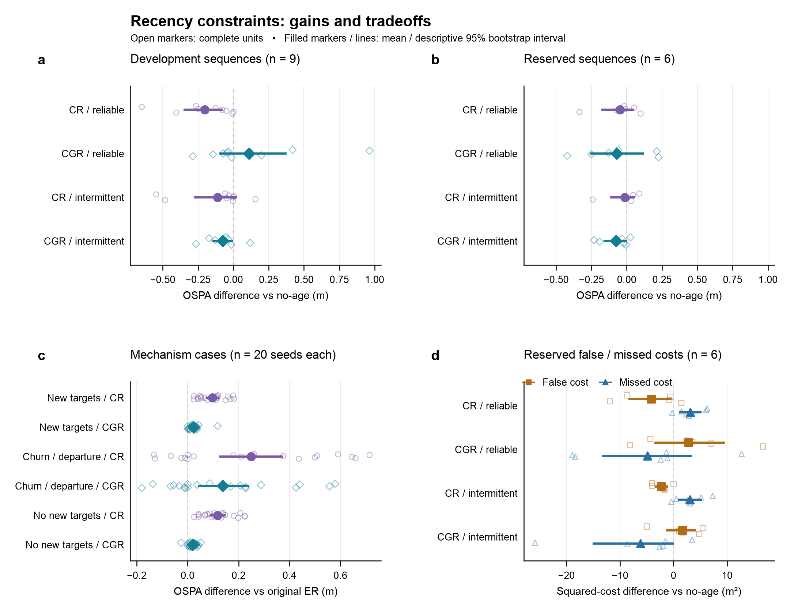

# 方法迭代记录：限制时效造成的正向存在概率放大

2026-09-08。三版规则、完整负结果与预留检验均保留；本报告由已通过独立指标重算的结果生成。

## 本轮结论

本轮实现三种规则，并完成各自约定的评估：IR 的完整开发集检验，以及 CR/CGR 的开发集、模拟机制集和预留检验。**保留 CGR 作为间歇通信方向的下一轮候选，CR 作为保守性对照；IR 的失败结果完整保留。尚未得到可宣称全面替代原 ER 的版本。**

可保留的具体进展是：只有被当前连续本地检测支持的正向存在声明，才允许时效进一步抬高其存在概率；其他情形限制时效的正向放大。该规则没有新增包字段，也没有调整原年龄核。

- **CGR 的间歇通信结果有一致方向。** 开发集 OSPA 为 5.0324，相对无时效 5.1086 下降 0.0762 m，配对区间 [−0.1410, −0.0111]，8/9 序列改善；预留集为 4.5378，相对无时效 4.6142 下降 0.0764 m，区间 [−0.1574, −0.0034]，5/6 序列改善。区间均是小样本描述性 bootstrap，不能作为普遍优势的证明。
- **相对原 ER 的增益仍有限。** CGR 在预留可靠链路上平均 OSPA 从 4.4401 降到 4.3288，但配对区间跨零；预留间歇链路为 4.5378 对原 ER 4.5364，基本持平。开发可靠链路中 CGR 仍差于无时效。两次检测确认无法保证排除持续误检。
- **CR 揭示了明确的误检—漏检取舍。** CR 在开发与预留、两种链路的四个均值上均优于无时效，但预留配对 OSPA 区间均跨零。预留可靠/间歇下，误检平方代价分别下降 4.1493/2.2814 m²，漏检代价增加 3.1406/3.0427 m²；间歇下只有 2/6 序列的 OSPA 改善，不能用总体小幅均值下降掩盖异质性。
- **模拟机制场景保留了反证。** CGR 恢复了 CR 损失的部分新目标发现/重连能力，但三个场景的 OSPA 均未追平原 ER。成员变化场景远端发现数为 CGR 7.90、CR 7.85、原 ER 8.00；发现能力尚未完全保住。

因此，本轮为“以本地证据约束正向时效放大”提供了部分实验支持，尚未证明该设计普遍必要或优越。下一次结构性迭代应检验关联不确定性与持续误检如何影响正证据可信度；不继续在这六个预留序列上调年龄核或确认门限。它们在本轮报告后已经成为已见数据，后续修订需要新的预留证据。

## 1. 改了什么，以及为什么

原 ER 对整个后验的存在对数几率赋予时效权重。整个后验包含历史传入信息、先验和本轮量测；直接感知机会较新，并不等于一个正向存在声明已经得到可靠的新量测支持。

先测试 IR：只让本轮本地更新增量承担时效修正。开发结果未修复问题，因此没有把最初的机制猜想写成已证实原因。随后测试 CR 的非正向约束，再测试 CGR 的局部确认例外。三次假设、检查和范围修订分别记录在 [PROTOCOL.md](PROTOCOL.md)、[AMENDMENT_CR.md](AMENDMENT_CR.md)、[AMENDMENT_CGR.md](AMENDMENT_CGR.md)。

CR 与 CGR 沿用原有检测、出生、运动、匹配、裁剪、剪枝、MAP 基数提取、通信日程和年龄核；不搜索衰减常数、门限或序列子集。

## 2. 固定输入的形式与边界

对一个已经对齐的 Bernoulli 标签，$\mathcal E$ 是原逻辑判定可参与存在融合的源，$b_j$ 是普通权重在该集合上的归一化，$a_j$ 是原空间权重。沿用

$$f_j=0.25+0.75e^{-\mathrm{age}_j/5\mathrm{s}},\qquad q_j=\frac{b_jf_j}{\sum_k b_kf_k},$$

无有效本地时间戳的已表示源使用 $f_j=0.25$；缺标签删失输入沿用 $f_j=1$，其存在上界和资格仍由原有可见域逻辑提供，本地增量为零。定义

$$p_a(x)=\eta_a^{-1}\prod_jp_j(x)^{a_j},\quad z_0=\sum_{j\in\mathcal E}b_j\operatorname{logit}(r_j)+\log\eta_a,\quad z_E=\sum_{j\in\mathcal E}q_j\operatorname{logit}(r_j)+\log\eta_a.$$

$r_0=\sigma(z_0)$ 和 $r_E=\sigma(z_E)$ 都来自**同一组当前递归输入**。它们与另行递归运行的无时效/ER 基线不是同一个反事实。

**IR：本地增量。** 每次本地更新重新计算 $\delta_j=\operatorname{logit}(r_j^+)-\operatorname{logit}(r_j^-)$，删失输入取零，

$$r_{IR}=\sigma\!\left(z_0+\sum_j(q_j-b_j)\delta_j\right).$$

这是近似 LMB 更新后的有效增量，不是经校准且跨源独立的似然比。新增一个 float64/目标；实际 4 维高斯包从 208 变成 216 字节/目标，另有 32 字节包头。

**CR：严格约束。**

$$r_{CR}=\min(r_0,r_E),\qquad p_{CR}=p_a.$$

这可从原 ER 的固定输入目标导出：最小化 $\sum_jq_jD_B(r\|r_j)+r\sum_ja_jD(p\|p_j)$，另加 $r\le r_0$。空间最优解仍为 $p_a$；标量目标导数为 $\operatorname{logit}(r)-z_E$，二阶导数为 $1/[r(1-r)]>0$，所以约束最优解是上述最小值。新增约束是设计选择，不是 Bayes 模型强制要求。

**CGR：确认门控。** 存在一个可参与的已表示源，同时满足 $q_j>b_j+10^{-12}$、$r_j\ge0.5$，以及连续两次本地更新的检测关联概率质量均至少 0.5，才允许 $r_E>r_0$；否则使用 CR。所有负向修正保留。

两次本地更新均须有直接感知机会和非空量测。漏检、无机会、空量测或标签本地更新中断都会清空连续计数。计数和上次更新时间留在本地；当前确认位使用原来已经分配的包字段，接收到的确认位不能推进本地计数。融合后恢复接收端自己的当前确认位。这里没有永久、可转传的确认凭证；持续误检仍然可能通过门控。两次/0.5 关联标准来自此前确认消融，未在预留数据上拟合。

三版只在固定当前输入下保持空间密度相同；递归时存在概率会影响后续关联、剪枝和提取。$r_{CR}\le r_0$ 不能推出递归 OSPA、误检数或漏检数必然下降。CR/CGR 无新增包字段或可调衰减参数。


## 3. 数据与统计单位

- 开发集：此前已看过的 9 个 V2V4Real 发布评估序列，1,993 帧、两车、两种链路。它们已参与方法诊断，不能称作本轮独立测试集。
- 预留算法迁移集：先按 ID 每五个取一个，选定 train 的 0000/0005/0010/0015/0020/0025/0030。运行前发现 0000 真值文件与开发 0000 完全相同，因此保留为单独重叠控制；主要结果使用其余六个序列，共 1,357 帧。未用跟踪输出剔除或替换序列。对全部 32 个 train 和 9 个 val 做过几何指纹检查，没有发现其他精确帧重复；这不能证明道路/行程独立。
- 检测器是在原 train 划分上训练的。预留仅指本轮融合方法未使用这些序列的跟踪结果，不代表新的检测测试基准。
- 模拟机制集：原有三类事件，每类 20 个固定种子，共 60 个缓存输入。CR/CGR 各运行一次，旧对照直接复用已冻结的配对结果。
- 真实回放仍为平面坐标、相对自车 CV 近似、固定名义检测概率与仿真通信。没有新增 3D 跟踪基准或完整 DMSTrack 方法复现。MIL-AM 和 TC 的共同后端适配边界沿用[外部实验报告](../../papers/icra2027/EXTERNAL_DATASET_RESULTS_CN.md)。

OSPA 使用 $p=2,c=12$ m；GOSPA 使用 $p=2,c=12$ m、$\alpha=2$。误检/漏检/定位分量是平方代价，单位 m²。先平均每序列所有节点帧，再对序列等权平均；模拟按种子等权。配对差值为候选减参照，负值更好。95% 区间是按序列或种子的 10,000 次 percentile bootstrap，固定种子 8301，属描述性区间；未做多重比较校正，不把相关帧当独立样本。

## 4. 真实数据：所有方案的平均 OSPA（m）

| 方案 | 开发/可靠 n=9 | 开发/间歇 n=9 | 预留/可靠 n=6 | 预留/间歇 n=6 |
| --- | --- | --- | --- | --- |
| Local | 6.5748 | 6.5748 | 6.0850 | 6.0850 |
| 无时效 | 4.7129 | 5.1086 | 4.3987 | 4.6142 |
| 原 ER | 4.8745 | 5.1193 | 4.4401 | 4.5364 |
| IR 增量版 | 4.8700 | 5.2807 | 未进入预留检验 | 未进入预留检验 |
| CR 严格约束版 | 4.5106 | 4.9968 | 4.3520 | 4.6008 |
| CGR 确认门控版 | 4.8227 | 5.0324 | 4.3288 | 4.5378 |
| MIL-AM | 5.1775 | 5.3089 | 4.4794 | 4.6156 |
| TC-OSPA² w=5 | 5.6895 | 5.7925 | 4.7013 | 4.9732 |
| TC-OSPA² w=10 | 5.5741 | 5.7647 | 4.7351 | 5.0133 |



图中所有浅色点是完整序列或种子单位，粗点/横线是均值和描述性 95% 区间；面板 d 为预留集误检/漏检平方代价相对无时效的变化。

## 5. 与自身对照的配对差值

胜出序列数仅为逐序列 OSPA 严格下降的计数；不作显著性检验。

| 数据 | 链路 | 候选 | 参照 | ΔOSPA [95% 区间] (m) | 胜出 |
| --- | --- | --- | --- | --- | --- |
| 开发 | 可靠链路 | CR 严格约束版 | 原 ER | -0.3640 [-0.8350, -0.0334] | 6/9 |
| 开发 | 可靠链路 | CR 严格约束版 | 无时效 | -0.2024 [-0.3456, -0.0823] | 8/9 |
| 开发 | 间歇链路 | CR 严格约束版 | 原 ER | -0.1225 [-0.3762, +0.0692] | 3/9 |
| 开发 | 间歇链路 | CR 严格约束版 | 无时效 | -0.1118 [-0.2717, +0.0184] | 7/9 |
| 开发 | 可靠链路 | CGR 确认门控版 | 原 ER | -0.0518 [-0.1867, +0.0692] | 5/9 |
| 开发 | 可靠链路 | CGR 确认门控版 | 无时效 | +0.1098 [-0.0917, +0.3693] | 6/9 |
| 开发 | 间歇链路 | CGR 确认门控版 | 原 ER | -0.0869 [-0.2433, +0.0283] | 6/9 |
| 开发 | 间歇链路 | CGR 确认门控版 | 无时效 | -0.0762 [-0.1410, -0.0111] | 8/9 |
| 预留 | 可靠链路 | CR 严格约束版 | 无时效 | -0.0467 [-0.1728, +0.0459] | 4/6 |
| 预留 | 可靠链路 | CR 严格约束版 | 原 ER | -0.0882 [-0.2685, +0.0807] | 4/6 |
| 预留 | 可靠链路 | CGR 确认门控版 | 无时效 | -0.0699 [-0.2546, +0.1148] | 4/6 |
| 预留 | 可靠链路 | CGR 确认门控版 | 原 ER | -0.1114 [-0.2905, +0.0086] | 4/6 |
| 预留 | 间歇链路 | CR 严格约束版 | 无时效 | -0.0134 [-0.1091, +0.0533] | 2/6 |
| 预留 | 间歇链路 | CR 严格约束版 | 原 ER | +0.0644 [-0.0694, +0.1669] | 1/6 |
| 预留 | 间歇链路 | CGR 确认门控版 | 无时效 | -0.0764 [-0.1574, -0.0034] | 5/6 |
| 预留 | 间歇链路 | CGR 确认门控版 | 原 ER | +0.0014 [-0.0177, +0.0184] | 3/6 |

## 6. 误差分解：改善的来源与代价

| 数据 | 链路 | 方案 | GOSPA m | 定位 m² | 漏检 m² | 误检 m² | 基数绝对误差 |
| --- | --- | --- | --- | --- | --- | --- | --- |
| 开发 | 可靠链路 | 无时效 | 10.9920 | 13.6552 | 103.3561 | 77.2386 | 1.3164 |
| 开发 | 可靠链路 | 原 ER | 11.1659 | 13.8598 | 96.5447 | 83.9677 | 1.2908 |
| 开发 | 可靠链路 | CR 严格约束版 | 10.5906 | 13.7457 | 104.2727 | 68.3739 | 1.2720 |
| 开发 | 可靠链路 | CGR 确认门控版 | 11.0272 | 14.0560 | 97.5682 | 79.8639 | 1.3104 |
| 开发 | 间歇链路 | 无时效 | 11.6501 | 16.8096 | 112.0890 | 81.1130 | 1.4017 |
| 开发 | 间歇链路 | 原 ER | 11.6750 | 17.1041 | 106.2622 | 85.5729 | 1.3753 |
| 开发 | 间歇链路 | CR 严格约束版 | 11.4441 | 17.1534 | 114.6187 | 75.7706 | 1.4106 |
| 开发 | 间歇链路 | CGR 确认门控版 | 11.5334 | 18.0741 | 106.5516 | 82.7197 | 1.3566 |
| 预留 | 可靠链路 | 无时效 | 11.6918 | 19.2613 | 75.3728 | 66.4819 | 1.3507 |
| 预留 | 可靠链路 | 原 ER | 11.7968 | 20.5782 | 70.2555 | 74.2112 | 1.4447 |
| 预留 | 可靠链路 | CR 严格约束版 | 11.5735 | 19.0725 | 78.5133 | 62.3326 | 1.3522 |
| 预留 | 可靠链路 | CGR 确认门控版 | 11.5554 | 21.0013 | 70.4858 | 69.3453 | 1.3571 |
| 预留 | 间歇链路 | 无时效 | 12.3188 | 19.3922 | 89.2947 | 70.0660 | 1.4613 |
| 预留 | 间歇链路 | 原 ER | 12.0700 | 18.5042 | 81.7427 | 72.4429 | 1.4596 |
| 预留 | 间歇链路 | CR 严格约束版 | 12.2554 | 18.6220 | 92.3375 | 67.7846 | 1.5009 |
| 预留 | 间歇链路 | CGR 确认门控版 | 12.0764 | 18.2374 | 83.1227 | 71.7377 | 1.4571 |

预留集的定位另在两方案共同匹配到的真值实例上比较，避免只看各自幸存轨迹的 RMSE。此表是共同目标实例的 pooled RMSE，不是序列宏平均；支持量随比较而变化。

| 链路 | 候选 | 参照 | 共同实例数 | 候选 RMSE m | 参照 RMSE m |
| --- | --- | --- | --- | --- | --- |
| 可靠链路 | CR 严格约束版 | 无时效 | 26068 | 1.2025 | 1.1996 |
| 可靠链路 | CR 严格约束版 | 原 ER | 25984 | 1.1934 | 1.1705 |
| 可靠链路 | CGR 确认门控版 | 无时效 | 26088 | 1.2310 | 1.2054 |
| 可靠链路 | CGR 确认门控版 | 原 ER | 26320 | 1.2330 | 1.1931 |
| 间歇链路 | CR 严格约束版 | 无时效 | 25677 | 1.1943 | 1.2232 |
| 间歇链路 | CR 严格约束版 | 原 ER | 25671 | 1.1817 | 1.1958 |
| 间歇链路 | CGR 确认门控版 | 无时效 | 25684 | 1.1983 | 1.2062 |
| 间歇链路 | CGR 确认门控版 | 原 ER | 25933 | 1.2100 | 1.2037 |

## 7. 原有机制场景：不能隐去的退步

重连 OSPA 为原协议的重连后十帧窗口；远端发现数是每次试验平均成功数量，无新目标控制中应为零。

| 场景 n=20 | 方案 | OSPA m | 漏检 m² | 误检 m² | 重连 OSPA m | 远端发现数 |
| --- | --- | --- | --- | --- | --- | --- |
| 分裂后新生 | 无时效 | 2.6513 | 29.6250 | 0.0337 | 3.2643 | 8.0000 |
| 分裂后新生 | 原 ER | 2.5692 | 28.6688 | 0.0337 | 2.5330 | 8.0000 |
| 分裂后新生 | CR 严格约束版 | 2.6662 | 29.8238 | 0.0300 | 3.2715 | 8.0000 |
| 分裂后新生 | CGR 确认门控版 | 2.5927 | 28.9538 | 0.0300 | 2.6403 | 8.0000 |
| 成员变化与离场 | 无时效 | 1.1227 | 8.1638 | 2.7000 | 1.2477 | 7.8500 |
| 成员变化与离场 | 原 ER | 0.8456 | 4.3838 | 3.0637 | 0.9261 | 8.0000 |
| 成员变化与离场 | CR 严格约束版 | 1.0952 | 8.4075 | 2.0438 | 1.1904 | 7.8500 |
| 成员变化与离场 | CGR 确认门控版 | 0.9833 | 6.7913 | 2.3513 | 1.0697 | 7.9000 |
| 无新目标控制 | 无时效 | 0.7966 | 3.3862 | 0.6788 | 3.1687 | 0.0000 |
| 无新目标控制 | 原 ER | 0.6679 | 2.3513 | 0.5700 | 2.1083 | 0.0000 |
| 无新目标控制 | CR 严格约束版 | 0.7855 | 3.4012 | 0.5437 | 3.1739 | 0.0000 |
| 无新目标控制 | CGR 确认门控版 | 0.6871 | 2.5425 | 0.5437 | 2.2631 | 0.0000 |

| 场景 | 候选 | 参照 | ΔOSPA [95% 区间] (m) | 胜出 |
| --- | --- | --- | --- | --- |
| 分裂后新生 | CR 严格约束版 | 原 ER | +0.0970 [+0.0756, +0.1195] | 0/20 |
| 分裂后新生 | CR 严格约束版 | 无时效 | +0.0149 [+0.0005, +0.0422] | 10/20 |
| 成员变化与离场 | CR 严格约束版 | 原 ER | +0.2496 [+0.1284, +0.3709] | 6/20 |
| 成员变化与离场 | CR 严格约束版 | 无时效 | -0.0275 [-0.0496, -0.0068] | 14/20 |
| 无新目标控制 | CR 严格约束版 | 原 ER | +0.1177 [+0.0908, +0.1449] | 0/20 |
| 无新目标控制 | CR 严格约束版 | 无时效 | -0.0110 [-0.0375, +0.0031] | 8/20 |
| 分裂后新生 | CGR 确认门控版 | 原 ER | +0.0236 [+0.0146, +0.0361] | 1/20 |
| 分裂后新生 | CGR 确认门控版 | 无时效 | -0.0585 [-0.0892, -0.0192] | 18/20 |
| 成员变化与离场 | CGR 确认门控版 | 原 ER | +0.1377 [+0.0444, +0.2359] | 7/20 |
| 成员变化与离场 | CGR 确认门控版 | 无时效 | -0.1394 [-0.1904, -0.0929] | 20/20 |
| 无新目标控制 | CGR 确认门控版 | 原 ER | +0.0192 [+0.0113, +0.0266] | 2/20 |
| 无新目标控制 | CGR 确认门控版 | 无时效 | -0.1095 [-0.1514, -0.0745] | 20/20 |

## 8. 核验与复现

全部新增完整结果合计 **195,216 个节点帧**，使用 Python/SciPy 从保存的状态独立重算指标；小规模指派另与穷举解对照。它是同一工作流程中的实现交叉检查，不是第三方独立复现。

解析检查覆盖固定输入最优解、空间密度不变、单源/等龄/零增量恒等、删失与未观测先验排除、包内容、确认位不由远端计数推进，以及缺失感知的计数重置。加速后的原 ER 在全部 7,972 个真实开发节点帧与旧状态输出逐元素完全一致；已完成慢版与快版的 IR/ER 共 4,824、CR 共 2,412 个节点帧也完全一致。

密集序列的 Hungarian 搜索热点做了试验目录内的等价向量化，保留行优先零元素和 tie break，35 个矩阵用例的匹配和代价与旧实现完全一致。保留被中止的慢版和性能诊断，均不混入完整结果。运行时修订见 [AMENDMENT_RUNTIME.md](AMENDMENT_RUNTIME.md)；本轮不据此声称方法本身获得计算优势。

完整预留数据/方法的 1,222 文件散列在跟踪前冻结，含两版完整真实开发汇总。原有 1,182 个源码/协议散列未变。全部保存的源快照再次核验通过。

可直接重算审计与本报告（从仓库根目录，Python 需 NumPy/SciPy/Matplotlib；本机使用 `tmp/external_baselines/venv/bin/python`）：

```sh
python3 trials/icra_external_fusion/fetch_dependencies.py
python3 trials/icra_method_iteration/analyze_development.py --candidate ir --accelerated
python3 trials/icra_method_iteration/analyze_development.py --candidate cr --accelerated
python3 trials/icra_method_iteration/analyze_development.py --candidate cgr --accelerated
python3 trials/icra_method_iteration/analyze_cases.py --candidate cr
python3 trials/icra_method_iteration/analyze_cases.py --candidate cgr
python3 trials/icra_method_iteration/analyze_transfer.py
python3 trials/icra_method_iteration/build_iteration_report.py
python3 trials/icra_method_iteration/plot_iteration.py
```

紧凑输入和完整结果均纳入版本管理。已保存的真实输入位于原目录 `../icra_external_fusion/data/` 及本目录 `data_transfer/`；60 个配对模拟输入来自原目录的已跟踪 MAT 缓存。完整跟踪重跑入口和日志说明见 [REPRODUCE.md](REPRODUCE.md)。冻结清单不应因源码差异而重新生成；`make_*.py`/`freeze_sources.py` 是本次开发构建记录，不属于复现入口。

结果文件：`summary_*.json` 保留全部聚合、配对差值与输入散列；`report_real_runs.csv` 收齐真实数据所有方案；`report_data.json` 是图表数据；`results_*/*.json.gz` 保存逐帧输出。当前 CGR 模拟日志的 START 行沿用生成器中的 CR 文本，实际结果 `arm=confirmation_recency` 已核验。

本报告对应新方法试验；主论文 PDF 仍对应此前冻结的 ER 实验版本。

## 9. 每一个真实序列的结果

包括被排除出主要汇总的重叠控制，开发编号与预留编号属于不同发布划分。全部数值为 OSPA（m）。

| 数据 | 编号 | 链路 | 帧数 | Local | 无时效 | 原 ER | IR 增量版 | CR 严格约束版 | CGR 确认门控版 | MIL-AM | TC-OSPA² w=5 | TC-OSPA² w=10 |
| --- | --- | --- | --- | --- | --- | --- | --- | --- | --- | --- | --- | --- |
| 开发 | 0000 | 可靠链路 | 147 | 8.3262 | 3.4342 | 3.8487 | 3.8117 | 3.1715 | 3.8535 | 4.4992 | 4.9378 | 4.6186 |
| 开发 | 0000 | 间歇链路 | 147 | 8.3262 | 4.0917 | 3.9613 | 4.0456 | 4.0349 | 4.0394 | 4.3505 | 5.7028 | 5.5583 |
| 开发 | 0001 | 可靠链路 | 114 | 7.9198 | 5.7997 | 7.1935 | 7.1935 | 5.1514 | 6.7643 | 7.1695 | 8.9355 | 8.4795 |
| 开发 | 0001 | 间歇链路 | 114 | 7.9198 | 6.6405 | 7.1011 | 8.4695 | 6.0948 | 6.4695 | 7.2719 | 8.1111 | 7.9676 |
| 开发 | 0002 | 可靠链路 | 144 | 6.9921 | 5.2046 | 5.0917 | 5.1160 | 5.0800 | 5.1697 | 6.3859 | 7.4670 | 7.0516 |
| 开发 | 0002 | 间歇链路 | 144 | 6.9921 | 6.1455 | 6.1486 | 6.1548 | 6.1150 | 6.1103 | 6.6112 | 6.4542 | 6.2927 |
| 开发 | 0003 | 可靠链路 | 198 | 7.8589 | 6.7647 | 6.4639 | 6.5021 | 6.5159 | 6.7193 | 6.9279 | 7.0255 | 7.1696 |
| 开发 | 0003 | 间歇链路 | 198 | 7.8589 | 6.9941 | 6.8904 | 6.8739 | 7.0004 | 6.8656 | 7.3669 | 7.2356 | 7.3278 |
| 开发 | 0004 | 可靠链路 | 180 | 5.0832 | 5.1915 | 5.1585 | 5.1573 | 5.1130 | 5.1190 | 4.8069 | 4.9573 | 5.0066 |
| 开发 | 0004 | 间歇链路 | 180 | 5.0832 | 5.0709 | 5.0238 | 5.0324 | 5.0682 | 5.0117 | 4.8243 | 4.9711 | 5.0225 |
| 开发 | 0005 | 可靠链路 | 310 | 6.3507 | 4.7447 | 4.5892 | 4.5962 | 4.6955 | 4.6013 | 4.8664 | 5.2209 | 5.2839 |
| 开发 | 0005 | 间歇链路 | 310 | 6.3507 | 5.0755 | 4.9418 | 4.9671 | 5.0279 | 4.9941 | 5.0905 | 5.6430 | 5.6761 |
| 开发 | 0006 | 可靠链路 | 304 | 6.3162 | 6.1856 | 6.3935 | 6.4049 | 6.1873 | 6.3845 | 6.4115 | 6.6445 | 6.4418 |
| 开发 | 0006 | 间歇链路 | 304 | 6.3162 | 6.1593 | 6.2097 | 6.1910 | 6.3163 | 6.2788 | 6.3483 | 6.5214 | 6.4205 |
| 开发 | 0007 | 可靠链路 | 221 | 8.0529 | 4.2146 | 4.2671 | 4.1835 | 3.8104 | 3.9285 | 4.5934 | 4.7553 | 4.7335 |
| 开发 | 0007 | 间歇链路 | 221 | 8.0529 | 4.8120 | 4.8232 | 4.8184 | 4.3290 | 4.5484 | 4.8639 | 5.8511 | 5.8740 |
| 开发 | 0008 | 可靠链路 | 375 | 2.2735 | 0.8766 | 0.8647 | 0.8647 | 0.8701 | 0.8647 | 0.9364 | 1.2620 | 1.3815 |
| 开发 | 0008 | 间歇链路 | 375 | 2.2735 | 0.9877 | 0.9736 | 0.9736 | 0.9844 | 0.9736 | 1.0530 | 1.6419 | 1.7427 |
| 预留 | 0005 | 可靠链路 | 217 | 6.2971 | 5.2480 | 5.2434 | — | 5.2313 | 5.1883 | 5.2462 | 5.5881 | 5.4881 |
| 预留 | 0005 | 间歇链路 | 217 | 6.2971 | 5.3864 | 5.3983 | — | 5.4756 | 5.4131 | 5.5273 | 5.8548 | 5.8076 |
| 预留 | 0010 | 可靠链路 | 119 | 5.6189 | 4.4218 | 4.7592 | — | 4.4748 | 4.6345 | 4.2014 | 4.3754 | 4.4221 |
| 预留 | 0010 | 间歇链路 | 119 | 5.6189 | 4.6460 | 4.6179 | — | 4.6921 | 4.6124 | 4.3482 | 4.7088 | 4.7505 |
| 预留 | 0015 | 可靠链路 | 145 | 6.6744 | 4.3293 | 4.2199 | — | 4.3200 | 4.2019 | 4.6399 | 4.6821 | 4.8597 |
| 预留 | 0015 | 间歇链路 | 145 | 6.6744 | 4.6334 | 4.4120 | — | 4.6218 | 4.4015 | 4.8665 | 5.1274 | 5.1997 |
| 预留 | 0020 | 可靠链路 | 275 | 5.8774 | 3.2487 | 2.9887 | — | 3.1782 | 2.9985 | 3.1728 | 3.4150 | 3.6612 |
| 预留 | 0020 | 间歇链路 | 275 | 5.8774 | 3.5876 | 3.3766 | — | 3.5918 | 3.3948 | 3.6087 | 4.0743 | 4.2880 |
| 预留 | 0025 | 可靠链路 | 450 | 5.5171 | 4.1755 | 4.2936 | — | 3.8413 | 3.7554 | 4.3224 | 4.5558 | 4.5051 |
| 预留 | 0025 | 间歇链路 | 450 | 5.5171 | 4.2539 | 4.2700 | — | 4.0136 | 4.2317 | 4.2477 | 4.4637 | 4.4230 |
| 预留 | 0030 | 可靠链路 | 151 | 6.5250 | 4.9686 | 5.1361 | — | 5.0665 | 5.1939 | 5.2937 | 5.5913 | 5.4745 |
| 预留 | 0030 | 间歇链路 | 151 | 6.5250 | 5.1779 | 5.1437 | — | 5.2097 | 5.1730 | 5.0953 | 5.6104 | 5.6112 |
| 重叠控制 | 0000 | 可靠链路 | 147 | 8.3262 | 3.4343 | 3.8488 | — | 3.1715 | 3.8535 | 4.4992 | 4.9378 | 4.6187 |
| 重叠控制 | 0000 | 间歇链路 | 147 | 8.3262 | 4.0917 | 3.9613 | — | 4.0349 | 4.0394 | 4.3505 | 5.7028 | 5.5584 |
