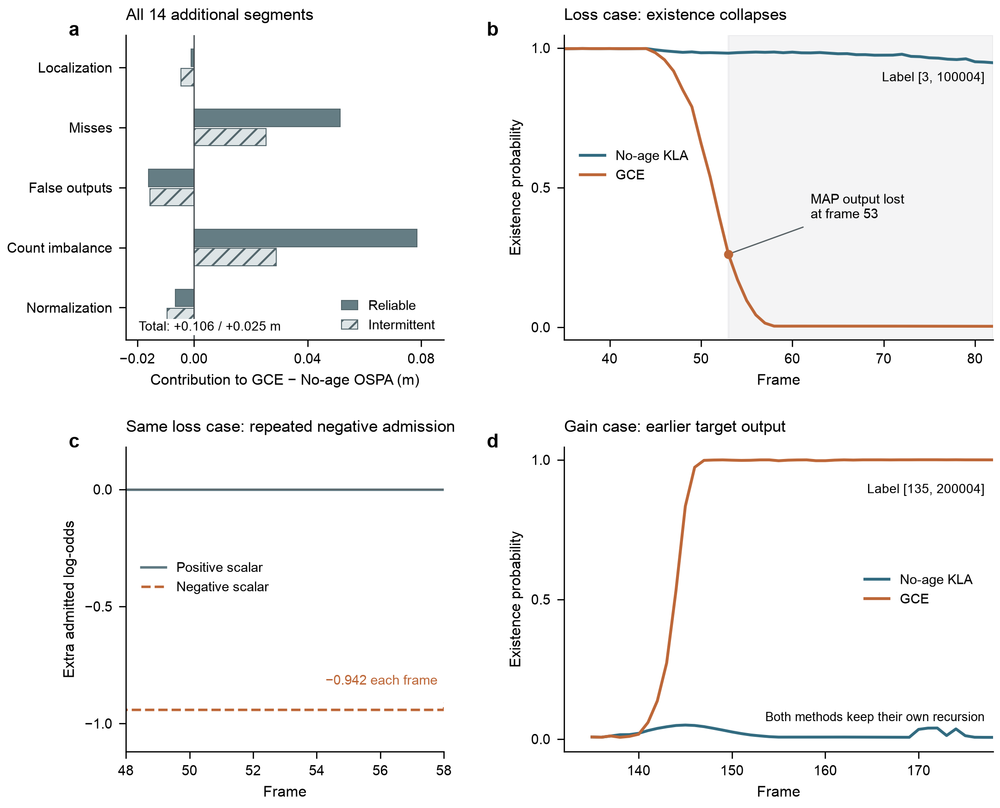

# 原 GCE 为什么在 V2X 上输给 No-age KLA

**最明确的失效链是存在概率被压低：几何覆盖区内长期单边无检，持续触发额外负证据；另一侧的准确检测又可能因分数门槛而几乎得不到额外正证据。低概率进入后续递归，最终使定位正确的分量无法被输出。**

诊断使用全部既有 5 段验证数据和新增 14 段测试数据，保留两种链路与两种方法各自完整递归的 76 份原生输出。数据现已曝光，本轮只做事后定位，没有修改方法、校准或测试集，也没有重跑或改写论文。

## 1. 差距首先体现为漏检与基数误差

| 数据 | 链路 | GCE OSPA | No-age KLA OSPA | GCE − No-age |
| --- | --- | ---: | ---: | ---: |
| 既有 5 段 | 可靠 | 8.408389 | 8.358842 | +0.049546 |
| 既有 5 段 | 间歇 | 8.338196 | 8.292353 | +0.045844 |
| 新增 14 段 | 可靠 | 8.592265 | 8.486016 | +0.106249 |
| 新增 14 段 | 间歇 | 8.487402 | 8.462835 | +0.024567 |

数值为片段等权均值，单位 m。新增 14 段来自五个采集日期；本轮没有把相关片段当作独立重复来新增显著性结论。

将每个机器人帧的 OSPA 差精确分解，再取片段等权均值，可得到以下可加的贡献。正值增加 GCE 的误差，负值抵消损失。

| 新增测试的 OSPA 差贡献（m） | 可靠 | 间歇 |
| --- | ---: | ---: |
| 定位 | -0.001040 | -0.004647 |
| 漏检 | +0.051380 | +0.025405 |
| 虚警 | -0.015967 | -0.015559 |
| 数量不平衡 | +0.078504 | +0.028924 |
| 最大目标数归一化 | -0.006629 | -0.009556 |

分解使用 OSPA² 的分子 `loc² + miss² + false² + 72|N−M|` 以及分母 `max(N,M)`，对分子与倒数分母作对称乘积分解，最后除以两方法 OSPA 之和。各项逐帧精确相加回原 OSPA 差；它是指标分解，不是独立机制效应。

## 2. 大多数漏出目标仍有正确位置的分量

在 2 m 一对一标注匹配下，只统计 No-age 输出而 GCE 没有输出的目标—机器人帧。检查 GCE 全部融合分量中、距离该目标 2 m 内存在概率最高的一条，区分剪枝、MAP 排名、裁剪和关联竞争。

| 新增测试 | 可靠 | 间歇 |
| --- | ---: | ---: |
| No-age 独有检出目标帧 | 1116 | 1084 |
| 分量仍在 2 m 内，但 MAP 基数／排名未选中 | 1092 | 1025 |
| 分量在 2 m 内，但存在概率已低于剪枝门槛 | 2 | 3 |
| 没有 2 m 内分量 | 22 | 47 |
| 分量已选中，但一对一匹配分给其他目标 | 0 | 9 |

仅 MAP 基数／排名一项占 **97.85%／94.56%**。这些分量的位置已足够接近标注，主要障碍在存在概率和输出数量。统计同时保留 GCE 独有检出，不能把 No-age 独有检出总数直接解释成全体净收益。

## 3. 一条已核对的递归失效链

图 b/c 对应新增 `v2xt_0001`、可靠链路、标注 ID 5、标签 `[3, 100004]`。这是新增可靠数据里最长的连续 No-age 独有检出区间：第 53–122 帧，共 70 帧；其中 69 帧有单侧 2 m 内检测支持。两辆车各自都出现同样的输出差距。

第 48–58 帧中，检出侧的中心误差约 0.04–0.13 m，局部存在概率增量为正。未检出侧仍执行 `P_D=0.9`，一次漏检的局部 log-odds 增量是 `log(0.1)=−2.302585`。其负门为 `0.9/(2−0.9)=0.818182`，额外系数为 `0.5×0.818182=0.409091`，因此每帧额外施加 **−0.941967 log-odds**。KLA 基础项本身已经包含局部漏检信息。

与此同时，检出侧校准分数约 0.424–0.682，低于冻结的正例先验 0.686912；由分数转出的似然比低于 1。正门 `max(0,tanh(log(LR)/2))` 对该正确检测为 0，考虑其他极小关联分量后，实际额外正项仍接近 0。曲率门控在这段全部放行，年龄项为 0，空间积分变化小于 10⁻¹²；这条具体失效链由额外负标量项主导。

| 第 53 帧，机器人 1 | 存在概率 |
| --- | ---: |
| GCE 当前输入上的无龄基础概率 r₀ | 0.475836 |
| 加入当前校正后的 GCE | 0.261402 |
| No-age 自己完整递归的结果 | 0.981249 |

当前输入上的 r₀ 与 No-age 自己的轨迹不同。前期概率差已进入后续预测和局部关联；到第 53 帧，仅替换最后一次融合无法抹掉这段历史。随后 GCE 进入低概率、反复出生与竞争的状态，正确位置的分量长期得不到输出。第 119 帧，该目标 2 m 邻域内仍有 **271 条**超过剪枝门槛的 GCE 分量，最大 r 仅 **0.002009**，r 总和为 **0.482731**；No-age 只有 **2 条**，最大 r 为 **0.898086**。存在概率分散到大量标签后，单条分量很难进入 MAP 输出。逐帧计数保存在 `FRAGMENTATION_DIAGNOSIS.json`。

几何覆盖没有证明真实可见性；本次没有据此把持续无检直接标成遮挡。

## 4. 固定当前输入的替换试验

以下只改变 GCE 已访问输入上的当前输出，完整重算 MAP 基数与评分；未收到消息的帧保持原局部输出。表中为新增 14 段的 OSPA 变化，负数更好。这些数值不是新方法的完整递归成绩。

| 当前输出替换 | 可靠 ΔOSPA | 间歇 ΔOSPA |
| --- | ---: | ---: |
| 移除已接纳的负标量增量 | -0.034189 | -0.028267 |
| 移除已接纳的正标量增量 | +0.039704 | +0.025922 |
| 移除年龄标量项 | -0.005530 | -0.005735 |
| 恢复旧空间积分 | +0.006371 | +0.001917 |
| 恢复旧位置均值 | +0.000038 | +0.000068 |
| 替换为该输入上的完整 No-age 输出 | +0.010450 | -0.001612 |

移除负标量项减轻了漏检，也增加了虚警平方项（可靠／间歇分别 +1.046／+0.828）。因此，不能把“全部关闭负证据”直接当作改进方案。移除正标量项则在两种链路都变差。图 d 保留了 `v2xt_0009` 的改善例子：同一原始标签在 GCE 中更早获得高存在概率，No-age 的输出仍然偏低。

还有一类损失来自虚警。旧验证 `v2x_0003` 间歇链路的最大退化窗口第 106–120 帧没有额外漏检，虚警平方项增加 33.6。已单独保留标签 `[100, 100002]` 的完整轨迹，避免把这类窗口强行解释为漏检或从诊断中删除。

## 5. 下一步的具体范围

优先研究**持续单边无检时，负证据应被信任到什么程度**，同时保留有用的正证据。应把几何覆盖、实际检测机会和当前证据可信度分开处理，并防止低置信度轨迹被反复压低后无法恢复。暂时没有证据支持继续增加关联冲突门槛。

后续任何修改都需要运行自己的完整递归，同时检查恢复的真实目标和新增虚警；本次固定输入的改善不能替代该检验。此前仅按当前关联率减弱负证据的筛查已经失败，本次没有重复包装该规则，也没有在这批已曝光数据上宣布新的泛化结果。

## 复核与交付

独立校验脚本核对了 1,597 份源文件／输入／结果哈希、11,164 个配对机器人帧、5,771 个目标诊断帧及 2,547 条具体原生轨迹记录。38 组片段—链路比较与全部汇总数值重算通过。

- `GAP_DIAGNOSIS.json`：全部 19 段误差分解、固定输入替换和连续区间。
- `TRACK_DIAGNOSIS.json`：7 个完整案例、失效分量、正负增量、MAP 排名和输入检测。
- `DIAGNOSIS_VERIFICATION.json`：独立源文件、算术和原生字段核验。
- `paired_robot_frames.csv.gz`、`target_robot_frames.csv.gz`：完整逐帧导出。
- `figures/`：可编辑 SVG、PDF、PNG 和全时间序列绘图数据。
- `README.md`：有效执行入口、初版病例选择错误及复现范围。

前一轮关联研究已单独归档在提交 `e661f2e88764dd90a2d6bfcab6a000ef3bcaba05`；本轮继续保持原论文与原始实验轨迹不变。
