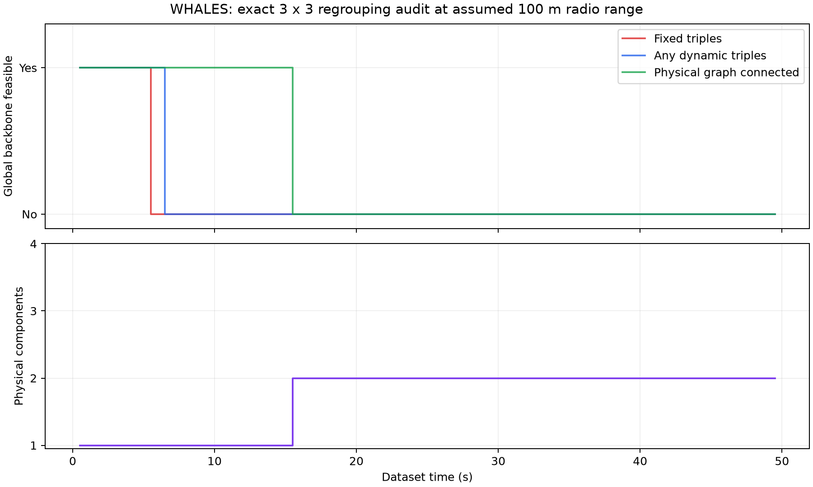

# 动态分组方向：可行性与投入边界

日期：2026-09-07。分支：`codex/icra`。

结论：值得做一个有退出条件的小实验，但不建议把“固定三个三人组，允许成员交换”作为新方法主体。更有意义的问题是：移动传感器在局部通信、成员离队/回归和不同视野下，如何维持有效且稳定的协同融合。基础原型的工程难度可控；能否形成独立于 ICASSP 的贡献，仍需跟踪实验和更完整的相关工作比较。

本目录是用户进一步授权的动态分组探索。原 `whales_pilot/PROTOCOL.md` 的固定分组实验及其失败结果保持原样。本次没有运行 LMB、生成观测、修改原策略，或报告任何跟踪收益。

## 本次确实做了什么

沿用原 WHALES 场景、9 个节点、全部 99 帧和假设的 100 m 通信范围。逐帧穷举全部 `9! / ((3!)^3 * 3!) = 280` 种不区分组编号的三组三人划分。仅使用当前传感器二维坐标，检查：

1. 每个三人组都有全部三条无向物理边，因而可以构造原策略所需的两个不同源有向局部环。
2. 三个组之间存在一棵树，树的中间组能为两个邻组分配不同接收节点。三组情况下仅需枚举三个中心，检查两个接收节点互异。

这给出的是原 `3 × 3` 架构在每一帧的精确结构可行性，不是某种聚类启发式的成绩，也不覆盖任意组大小或其他融合骨干。

再实现一个因果选择规则：当前分组可行就保留；失效时先最小化成员换组数，再最小化当前组内距离平方和。成员变化通过三个组的全部编号匹配计算，整体换组名不算换组。无可行方案时记录失败，保留上次成员关系仅供以后计算切换成本；不虚构一张可运行网络。该选择器掌握全体当前节点位置，是集中式结构诊断，不是已实现的分布式组协商协议。

最后，对选出的每个可行帧直接调用未修改的 MATLAB V240/V242，核实物理边、强连通性和消息数。每帧使用空路由历史，因此验证的是单帧构造，不是跨组迁移时的滤波器或缓存正确性。

| 检查项 | 本序列结果 |
|---|---:|
| 固定三个三人组可行 | 10 / 99 帧 |
| 任意三个三人组可行 | 12 / 99 帧 |
| 物理图全局连通 | 30 / 99 帧 |
| 物理连通、但不存在三组三人可行划分 | 18 帧（13–30） |
| 选定动态分组的原策略交叉验证 | 12 帧全部通过 |
| 选择器发生换组 | 1 次，在第 11 帧，共 3 个节点换组 |
| 物理连通分量变化 | 第 31 帧，从 9 变为 8＋1，之后没有重连 |

第 11 帧（5.5 s）原车辆编号的分组从 `{0,2,4}/{1,5,6}/{3,7,8}` 变为 `{0,4,6}/{1,5,7}/{2,3,8}`。只能多支持第 11、12 帧。第 13 帧起不存在覆盖所有节点的三个互不重叠三角形；第 17–30 帧车辆 2 仅有一个通信邻居，无法进入至少三人的局部环。第 31 帧起车辆 2 孤立。最后两类障碍无法单靠更聪明的成员交换解决。

作为结构参照，同时构造了每个物理连通分量内的双向最小生成树，核实所有边存在、连通分量与物理图一致。它在前 30 帧需要 16 条有向消息边，后 69 帧为 14 条，总平均 14.606。这个参照没有组内环要求，说明可以用相对简单的骨干支持当前可达节点之间的通信。

这里的“支持通信”不代表每帧所有信息已传遍分量：一轮融合仍只跨一跳，也未模拟丢包。16/14 是每条有向边发一条后验消息的计数，不是字节数、精度或优于 V242 的证明；原 V242 的 13 条仅在其可行帧适用。断网期间也不能要求两个分量即时达成全局一致。



## 建议研究的问题

可以把主问题写成：**在移动节点不断改变可通信邻居时，如何组织变规模局部融合组，在有限通信下保持多目标跟踪质量，并减少频繁重组造成的状态和通信代价？**

这仍然是二维传感器融合。机器人运动可以由预设可执行的二维路径或数据集轨迹提供，不必把运动规划、控制或实机系统都加入主贡献。但实验需要实际出现视野变化、离队、重连或成员交换，机器人图标本身不能构成与旧论文的区别。

| 设计层次 | 可探索内容 | 建议 |
|---|---|---|
| 可变成员，固定三人组 | 交换成员以修复局部环 | 已检查，上限只有 12 帧，不作为主线 |
| 可变组大小和数量 | 单节点继续本地估计，双节点互通，大组用可行稀疏骨干 | 最先做的基础能力，工程难度中等 |
| 稳定重组 | 失效时立即拆分；合并要求链路持续存在；有收益才换组 | 适合做第一版候选方法，需与简单基线比较 |
| 融合状态连续性 | 永久节点身份、目标标签、消息时间戳在换组后继续有效 | 必须保证正确，不能靠清空后验“恢复” |
| 重连时的信息相关性 | 避免同一历史消息无意义回流，诊断过时或重复信息影响 | 潜在深入方向；不宜一开始承诺完整一致性理论 |

第一版可用“当前几何可行性＋切换成本”的确定性规则。若几何方案已足够，未必值得再增加复杂优化；只有在固定字节预算下仍出现明显的融合退化，才考虑加入可在线获取的后验分歧、观测覆盖或信息时效。目标真值、未来轨迹与离线误差不能用于分组决策。

不建议一开始引入强化学习、GNN 或联合运动控制。也不应把“局部最小树”包装成新算法；它是应该击败或匹配的强简洁基线。动态分组需证明超出直接在时变图上运行普通融合的价值。

## 与 ICASSP 的边界、已有工作和 ICRA 适配

ICASSP 当前关注固定组结构下的稀疏消息选择、因果修复与通信代价。新工作若成立，主要自变量应转为组成员/组规模变化，主要问题转为组变化下的融合连续性和有效信息交换，实验主轴应转为分裂、汇合、视野互补与换组频率。

动态聚类本身已有长期研究，不宜声称首次提出：

- Gning、Mihaylova，FUSION 2009：*Dynamic clustering and belief propagation for distributed inference in random sensor networks with deficient links*。作者所在大学的出版记录明确列出动态聚类与缺陷链路下的推断研究。本次核对到题录，未据此声称掌握全文算法细节。[Lancaster 作者出版记录](https://www.research.lancs.ac.uk/portal/en/people/lyudmila-mihaylova%2888fb74ba-34c7-498c-8008-3ec34d67d696%29/publications.html?descending=true&ordering=researchOutputOrderByAuthorLastName&page=1&pageSize=50)
- Ramachandran 等：*Resilience in multi-robot multi-target tracking with unknown number of targets through reconfiguration*，2020 预印本。传感器退化时重配通信网络，以分布式 PHD 融合改善跟踪，并限制激活链路变化；网络重配置由中央系统计算。因此“多机器人跟踪＋网络重配置＋通信成本”也不是空白。[作者论文摘要](https://arxiv.org/abs/2004.07197)
- Banerjee、Schneider：*Decentralized Multi-Agent Active Search and Tracking when Targets Outnumber Agents*，DecSTER，关联 ICRA 2024 DOI。使用 PHD 后验与主动决策，应对异步和不可靠通信；其重点包含主动搜索。说明这类协同跟踪问题与 ICRA 有交集，并不证明仅靠改 Intro 就足以满足投稿要求。[作者论文与 ICRA DOI](https://arxiv.org/abs/2401.03154)

这是方向筛查，不是系统性新颖性审查。对 ICRA 适配性的判断是基于问题和既有论文的推断，不是录用预测，也没有引用尚未核实的 ICRA 2027 专属审稿要求。若后续只显示“分组随位置变化能继续运行”，论文贡献仍然偏弱。

## 原型实现范围与难度

现有代码可复用 LMB 更新、观测生成、消息缓存和误差统计，但固定编组假设分布在多个接口，不能只修改 `sensorGroupIds`：

- `common/buildDynamicTopologyPhysicalIdentityRegistry.m` 目前把节点 UID 定义为初始编组 UID 与组内角色的组合。新实验应直接保留永久车辆/传感器 UID，分组编号仅表示当前成员关系。
- `common/selectCausalMinimalEditFormationTreeV240Policy.m` 会用当前组解释上一帧节点邻接矩阵。成员改变时，这不自动等于上一帧的组间树，必须显式管理组变更和路由历史。
- `common/buildIndexEquivariantFormationBackboneReference.m` 的至少三节点局部环，以及 V242 的 `N+2(F-1)` 消息公式，不直接适用于单节点、双节点或多连通分量。
- `multisensorLmb/runEventTriggeredDistributedLmbFilter.m` 的节点后验、接收缓存和身份注册需要保持对应。组变更时保留节点后验；过期消息依据消息时间和合法链路处理，不能重置真值先验或改名绕过场景检查。

建议新建独立实验入口和拓扑策略，复用估计模块，并针对必要接口做有限改动。第一版先保持固定融合公式，区分“结构可行”与“估计更好”。KLA 的权重归一不等同于任意分裂/重连下的一致性保证，也不能直接将其说成独立似然重复相乘；需要实测相关信息的影响后再定义更强理论目标。

## 下一步最小实验与退出条件

建议使用三个预先定义的二维机制场景：始终连通但邻居改变；分成两队后重新汇合；通信阈值附近出现短暂链路抖动。路径由限速、平滑运动生成，两个分量都应包含多个节点。WHALES 当前序列保留作外部轨迹压力测试，因为它缺少多节点分队后重连，不能独自验证合并恢复。

先用 3 个固定随机种子比较四组：本地 LMB、每帧重算的分量内双向树、无稳定机制的动态小组、带保留/合并等待机制的动态小组。组数和大小允许改变；组内骨干退化处理及最大消息预算需在看跟踪结果前固定。双向树是一项独立强基线，旧 V242 可行片段仅作辅助参照，不作为新方法唯一对手。分组协议第一版可以集中计算，但必须标明；不能把全局位置交换与重组协调默认为免费。

所有方案共用观测、丢包随机数、出生先验和融合轮数；出生先验独立于实际目标位置，不能使用当前真值初始化构造器。预算包含实际后验字节及重组控制信息，消息条数仅辅助统计。记录全序列 OSPA/数量误差、节点尾部误差、成员变化次数、通信字节、计算时间，以及重连后恢复曲线。另报按预先定义的任务区域计算的可观测性诊断，不能在断网后临时删除难目标改善主指标。恢复参照需使用同预算、相同因果信息的策略。

继续条件：与普通时变图融合相比，在接近的通信预算下，有可重复的质量或重连恢复收益；或在接近误差下明显减少通信/频繁切换。第一轮以效果方向和成本判定，不用三个种子宣称显著性或跨场景泛化。

收缩或换方向条件：只胜过失效的固定组方法；收益完全来自更多消息；稳定机制只是减少换组次数却无任务价值；或必须同时重写标签关联、滤波器和分布式一致性理论才看得到信号。若出现这些情况，优先转向范围更小的时变邻居选择或局部视野下的有效信息交换，并再次核对与 ICASSP 的区别。

## 复现与文件

Python 需要 NumPy、Matplotlib；也支持前一实验放在 `tmp/whales_deps` 的依赖：

```text
python trials/whales_dynamic_groups/analyze_group_feasibility.py
matlab -batch "addpath('trials/whales_dynamic_groups'); result=verifyDynamicGroupCandidates();"
```

`feasibility.json` 保存输入 SHA-256、逐帧全部可行分组数量、选定成员关系、物理分量及消息计数。`policy_verification.json` 保存实际调用原策略通过的帧。原始元数据获取和来源见 `../whales_pilot/README_CN.md`。
