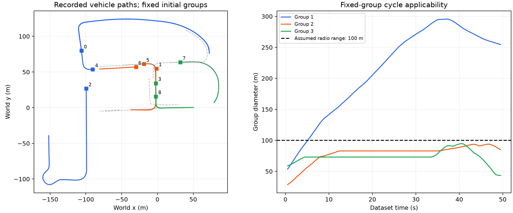

# WHALES 二维协同感知：首次适用性预实验

日期：2026-09-07。分支：`codex/icra`。
原方法源码基点：`7596f6dc0371dcd2bae74fae9b0ad91ba4b4f19a`。

**结论：公开数据已经转换成功，但原 V240/V242 的固定组内环前提未通过。
按照预先记录的停止条件，没有启动四组 × 三随机种子的滤波实验，不能报告
OSPA、定位精度、目标召回或通信字节收益。**

## 数据与设定

使用 [WHALES 官方数据](https://github.com/chensiweiTHU/WHALES)的验证集元数据。
这是真实下载的 CARLA 仿真记录，不是真实车辆采集实验。
元数据包 207096707 字节，未下载图像、点云或运行 CARLA。

按场景名排序，选择第一个至少九个车辆节点、至少八十个同步帧的序列：
`2024-02-26-07-10-14`。原记录有十辆感知车辆及一个路侧节点；取车辆槽位
0--8 作为九个移动传感器，排除路侧节点，并排除全部十辆感知车辆作为目标。
保留其余七个目标（原注释索引 10--16），99 帧，时间戳 0.5--49.5 s，步长 0.5 s。

按初始位置最小化组内两两距离平方和，分成三组，每组三节点：

| 组 | 原车辆槽位 |
| --- | --- |
| 1 | 0, 2, 4 |
| 2 | 1, 5, 6 |
| 3 | 3, 7, 8 |

分组只使用首帧位置；没有按后续轨迹或滤波表现选组。
通信范围固定为 100 m，这是本次预实验的合成无线假设，不是 WHALES 的实测链路。
其余计划条件和停止规则见 [PROTOCOL.md](PROTOCOL.md)。

## 实际运行结果

直接调用仓库内未修改的 `selectCausalMinimalEditFormationTreeV240Policy`
及 `selectCausalMinimumFormationBackboneV242Policy`，逐帧检查几何上的路由
可构造性。没有运行观测生成或 LMB 滤波。失败后的逐帧调用仅是结构诊断，
不代表滤波器在失败后进行了有效的因果续跑。

| 检查 | 结果 |
| --- | --- |
| 同步时间戳、有限坐标/速度、连续注释索引 | 通过 |
| 感知车辆槽位与对应标注位置核对 | 通过（地面中心偏差小于 1 m） |
| 完整因果路由可构造 | 10 / 99 帧 |
| V242 稀疏路由可构造 | 10 / 99 帧 |
| 首次路由失败 | 第 11 帧，数据集时间 5.5 s |
| 首次失败错误 | `IndexEquivariantFormationRoute:NoLocalCycle` |
| 九节点物理图连通 | 30 / 99 帧 |
| 物理图仍连通但固定组内环已不可行 | 20 帧（第 11--30 帧） |
| 首次整个物理图不连通 | 第 31 帧，15.5 s |
| 可行帧的计划消息：完整 / 稀疏 | 18 / 13 条每帧 |
| 四组滤波的前置条件 | 未通过，未启动 |

第 11 帧，第一组中车辆 0 与车辆 2 相距 103.604 m，超过 100 m 通信范围。
对三节点组和距离对称物理图，有向环要求三对节点都可通信；此时两车不能
直接连接。原方法修复的是组间树，无法解决这个组内结构问题。
整个序列最大的组内直径为 295.663 m。



左图是导出的地面轨迹：彩色实线为感知车辆，方形标记为起点，数字为原车辆槽位；
灰色虚线为七个目标。右图显示各固定组直径。车辆独立转向、驶离使初始近邻
逐渐分离。没有将这些车辆重新绘成固定编队，也没有增加物理不可用的边。

18 与 13 是成功构图帧的计划消息数量，不能当成实际字节节省或完整序列收益。
这些结果只针对这个序列、初始分组及 100 m 假设；不能推广为所有道路协同感知
场景下 V242 都不适用，也不能说明其融合公式本身无效。

## 对下一步研究的具体启示

本次发现一个可明确区别于 ICASSP 编队设定的问题：**独立运动节点会让组内连接
失效，且早于整个通信网络的分裂。** 若保留这一类道路场景，新方法需要研究
可变化的协作分组、一般物理图上的稀疏消息选择，或暂时分裂后的信息保留。
这些是待研究的问题，当前没有实现或验证新方法。

若下一步只想快速比较已有融合模块，可以另行设计不依赖固定组内环的通信对照；
那应明确标为新的实验设定，不能继续称为“原 V242 的直接迁移”。

## 文件与复现

- `converted_scene.json`：可直接读取的二维位置、速度、朝向、原 ID、时间戳、
  数据完整性检查及原文件 SHA-256。
- `converted_scene.mat`：相同二维数据的 MATLAB 输入。
- `routing_preflight.json`：两种原路由逐帧成功标记、失败原因及物理连通情况。
- `prepare_whales.py`：限定 NumPy 类型的元数据读取、确定性分组、转换和绘图。
- `runWhalesRoutingPreflight.m`：原路由函数的逐帧适用性检查。
- `fetch_whales_metadata.py`：官方元数据下载与定名提取。

已经转换的 `.mat` 与 `.json` 随分支保留，可直接复现 MATLAB 检查，无需再次下载：

```matlab
addpath('trials/whales_pilot');
result = runWhalesRoutingPreflight();
```

重新转换需要 Python 的 NumPy、SciPy、Matplotlib。仓库内运行顺序：

```text
python trials/whales_pilot/fetch_whales_metadata.py
python trials/whales_pilot/prepare_whales.py
```

原始大文件和本次临时 Python 依赖保存在 Git 忽略的 `tmp/` 中。
首次运行的 MATLAB 输出另保存在 `matlab_preflight.log`。
